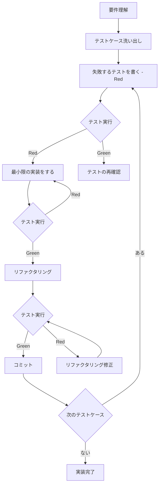

# Kent Beck や t-wada 氏らが推奨する TDD が実践されているように見受けられない

**仕様書 ID:** 3da4f19d-26f3-451e-bb62-de8d01202321
**フェーズ:** tasks
**作成日時:** 2025/11/21 11:35:04
**更新日時:** 2025/11/21 11:42:50

---

## 1. 背景と目的

### 背景

cc-craft-kit プロジェクトでは、多数の機能実装とテストコードが存在するものの、Kent Beck や和田卓人氏が推奨する本格的な **テスト駆動開発（TDD）** が実践されていない。

**現状の問題点**:

- 実装後にテストを書く「テストラスト」のアプローチが多い
- Red-Green-Refactor サイクルが遵守されていない
- テストコードが実装の品質保証ではなく、事後的な検証に留まっている
- リファクタリングの安全性が低い（テストがないため変更を躊躇する）

### 目的

本仕様の目的は、**TDD の 3 原則（Red-Green-Refactor）** を実践し、以下を達成すること。

1. **テストファースト原則の徹底**: 実装前に必ず失敗するテストを書く
2. **リファクタリングの安全性向上**: テストが品質を保証し、安心してコードを改善できる
3. **設計品質の向上**: テスタブルな設計を自然に導く
4. **ドキュメントとしてのテスト**: テストコードが仕様書として機能する

---

## 2. 対象ユーザー

- **cc-craft-kit 開発チーム全員**（開発者、メンテナー、コントリビューター）
- **Claude Code ユーザー**（TDD の実践例として参考にする）

---

## 3. 受け入れ基準

### 必須要件（TDD プロセスの遵守）

- [ ] すべての新機能・バグ修正において、実装前にテストを書いている
- [ ] コミット履歴で「テスト追加 → 実装 → リファクタリング」の順序が確認できる
- [ ] テストが失敗した状態で実装を開始していない（Red フェーズを確認できる）
- [ ] Red-Green-Refactor サイクルが最低 3 回以上実践されている

### 機能要件（テストの品質）

- [ ] すべてのテストが意図を明確に表現している（テスト名から何を検証しているか分かる）
- [ ] テストコードが実装コードと同等以上の品質である
- [ ] テストがフレームワークのベストプラクティスに従っている（Vitest の場合、`describe`, `it`, `expect` の適切な使用）
- [ ] テストケースがエッジケース、正常系、異常系を網羅している

### 非機能要件（継続的な品質保証）

- [ ] テストスイートが 10 秒以内に完了する（高速フィードバック）
- [ ] CI/CD パイプラインでテストが自動実行される
- [ ] テストカバレッジレポートが自動生成され、80% 以上を維持している
- [ ] カバレッジレポートが GitHub Actions の PR コメントに自動投稿される

---

## 4. 制約条件

- **テスティングフレームワーク**: Vitest（既存のまま変更しない）
- **カバレッジツール**: c8（Vitest に統合済み）
- **CI/CD**: GitHub Actions（既存のまま変更しない）
- **既存テストコードの互換性**: 既存のテストコードを破壊しない（段階的に TDD へ移行）
- **学習コスト**: TDD の学習に時間を要するため、段階的な導入を推奨

---

## 5. 依存関係

- **Vitest**: テスト実行とカバレッジレポート生成
- **GitHub Actions**: CI/CD パイプラインでの自動テスト実行
- **既存のテストコード**: `tests/` ディレクトリ配下のすべてのテストファイル
- **カバレッジレポート**: `npm run test:coverage` で生成される HTML レポート

---

## 6. 参考情報

### TDD 関連書籍

- Kent Beck『テスト駆動開発』（オーム社）
- 和田卓人『テスト駆動開発の実践』（技術評論社）
- Robert C. Martin『Clean Code』（アスキー・メディアワークス）

### TDD 関連記事・動画

- [和田卓人氏の TDD ライブコーディング - YouTube](https://www.youtube.com/watch?v=Q-FJ3XmFlT8)
- [TDD の 3 原則（Red-Green-Refactor）- Martin Fowler](https://martinfowler.com/bliki/TestDrivenDevelopment.html)

### テスティングフレームワーク

- [Vitest - Next Generation Testing Framework](https://vitest.dev/)
- [Vitest Best Practices](https://vitest.dev/guide/)

### カバレッジツール

- [c8 - Code Coverage Tool](https://github.com/bcoe/c8)
- [Istanbul - JavaScript Code Coverage](https://istanbul.js.org/)

---

## 7. テスト戦略（TDD 実践方針）

### Red-Green-Refactor サイクルの遵守

1. **Red（失敗するテストを書く）**:
   - 実装前に必ずテストを書く
   - テストが失敗することを確認する（`npm test` で Red を確認）
   - テスト名で何を検証するか明確に表現する

2. **Green（テストを通過する最小限のコードを書く）**:
   - テストを通過させるための最小限の実装をする
   - 過剰な実装をしない（YAGNI: You Aren't Gonna Need It）
   - すべてのテストが通過することを確認する

3. **Refactor（コードを改善する）**:
   - テストが通過した状態で、コードをリファクタリングする
   - リファクタリング後もテストが通過することを確認する
   - テストコード自体もリファクタリングの対象とする

### テストカバレッジ目標

- **ステートメントカバレッジ**: 80% 以上
- **ブランチカバレッジ**: 70% 以上
- **関数カバレッジ**: 90% 以上

### テストの種類

- **単体テスト（Unit Test）**: すべての関数・メソッドに対して作成
- **統合テスト（Integration Test）**: モジュール間の連携を検証
- **E2E テスト（End-to-End Test）**: 主要なユーザーフローを検証

---

## 8. TDD 実践チェックリスト

### コード作成前

- [ ] 要件を明確に理解している
- [ ] テストケースをリストアップしている
- [ ] エッジケース、正常系、異常系を洗い出している

### テスト作成時（Red フェーズ）

- [ ] テストが失敗することを確認した（Red）
- [ ] テスト名が要件を明確に表現している
- [ ] 1 つのテストが 1 つの観点のみを検証している
- [ ] テストコードが読みやすく、意図が明確である

### 実装時（Green フェーズ）

- [ ] テストを通過する最小限のコードを書いた（Green）
- [ ] すべてのテストが通過することを確認した
- [ ] 過剰な実装をしていない（YAGNI 原則を遵守）

### リファクタリング時（Refactor フェーズ）

- [ ] コードをリファクタリングした（Refactor）
- [ ] リファクタリング後もテストが通過することを確認した
- [ ] テストコード自体もリファクタリングした
- [ ] コードの可読性と保守性が向上した

### コミット時

- [ ] コミットメッセージに「Red → Green → Refactor」のサイクルを記録
- [ ] コミット履歴から TDD の実践が確認できる

---

## 9. 既存コードの TDD 適合性評価

### 評価対象

- [ ] `tests/` ディレクトリ配下のすべてのテストファイル
- [ ] テストカバレッジレポート（`npm run test:coverage`）

### 評価基準

1. **テストファースト原則**: Git コミット履歴から「テスト → 実装」の順序を確認
2. **テストの独立性**: 各テストが他のテストに依存していないか
3. **テストの可読性**: テスト名から意図が明確に分かるか
4. **カバレッジ**: 80% 以上を達成しているか

### 改善計画

- TDD 原則に違反している箇所をリストアップ
- 段階的に修正するタスクを作成
- 新規実装は必ず TDD で実施

---

## 10. 設計

### アーキテクチャ概要

TDD を実践するための開発環境とワークフローを設計します。

```text
┌─────────────────────────────────────────────┐
│         TDD ワークフロー                    │
├─────────────────────────────────────────────┤
│                                             │
│  1. Red フェーズ                            │
│     ├── テストケースの洗い出し             │
│     ├── 失敗するテストを書く               │
│     └── npm test で Red を確認             │
│                                             │
│  2. Green フェーズ                          │
│     ├── 最小限の実装をする                 │
│     ├── テストを通過させる                 │
│     └── npm test で Green を確認           │
│                                             │
│  3. Refactor フェーズ                       │
│     ├── コードをリファクタリング           │
│     ├── テストが通過し続けることを確認     │
│     └── カバレッジレポートを確認           │
│                                             │
│  4. Commit                                  │
│     ├── Red → Green → Refactor を記録      │
│     └── Git コミットで履歴を残す           │
│                                             │
└─────────────────────────────────────────────┘
```

### 開発環境構成

TDD を実践するための開発環境は以下の通りです。

| コンポーネント | ツール | 役割 |
|---|---|---|
| **テストランナー** | Vitest | テスト実行、カバレッジレポート生成 |
| **アサーションライブラリ** | Vitest (内蔵) | テストの期待値検証 |
| **カバレッジツール** | c8 (Vitest 統合) | コードカバレッジ測定 |
| **CI/CD** | GitHub Actions | 自動テスト実行、PR チェック |
| **Git フック** | Husky + lint-staged | pre-commit でリント実行 |
| **リンター** | ESLint | コード品質チェック |
| **フォーマッター** | Prettier | コードフォーマット統一 |

### TDD 実践プロセスフロー



### データモデル

TDD 実践の進捗管理には、既存のデータベーススキーマを使用します。

#### specs テーブル（既存）

TDD 実践の仕様書を管理します。

```typescript
interface Spec {
  id: string;                  // 仕様書 ID
  name: string;                // 仕様書名
  description: string | null;  // 説明
  phase: SpecPhase;            // フェーズ（requirements → design → tasks → implementation → completed）
  branch_name: string;         // ブランチ名
  created_at: string;          // 作成日時
  updated_at: string;          // 更新日時
}
```

#### github_sync テーブル（既存）

GitHub Issue との同期を管理します。

```typescript
interface GitHubSync {
  id: number;                  // 同期 ID
  entity_type: 'spec';         // エンティティタイプ（spec 固定）
  entity_id: string;           // 仕様書 ID
  github_id: number;           // GitHub Issue ID
  github_number: number;       // GitHub Issue 番号
  github_node_id: string;      // GraphQL ノード ID
  sync_status: 'success' | 'failed' | 'pending';  // 同期ステータス
  last_synced_at: string;      // 最終同期日時
  created_at: string;          // 作成日時
  updated_at: string;          // 更新日時
}
```

### テストコード設計指針

#### テストファイル命名規則

```text
src/
  commands/
    spec/
      create.ts                # 実装
tests/
  commands/
    spec/
      create.test.ts           # 単体テスト（同じディレクトリ構造）
```

#### テスト構造のベストプラクティス

```typescript
import { describe, it, expect, beforeEach, afterEach } from 'vitest';

describe('functionName', () => {
  // テストの前処理
  beforeEach(() => {
    // テストデータの準備
  });

  // テストの後処理
  afterEach(() => {
    // テストデータのクリーンアップ
  });

  describe('正常系', () => {
    it('should return expected value when given valid input', () => {
      // Arrange（準備）
      const input = 'valid input';

      // Act（実行）
      const result = functionName(input);

      // Assert（検証）
      expect(result).toBe('expected value');
    });
  });

  describe('異常系', () => {
    it('should throw error when given invalid input', () => {
      // Arrange
      const invalidInput = null;

      // Act & Assert
      expect(() => functionName(invalidInput)).toThrow('Error message');
    });
  });

  describe('エッジケース', () => {
    it('should handle empty string correctly', () => {
      // Arrange
      const emptyInput = '';

      // Act
      const result = functionName(emptyInput);

      // Assert
      expect(result).toBe('');
    });
  });
});
```

#### AAA パターン（Arrange-Act-Assert）

すべてのテストは以下の構造に従います。

1. **Arrange（準備）**: テストデータとモックを準備
2. **Act（実行）**: テスト対象の関数を実行
3. **Assert（検証）**: 期待値と実際の結果を比較

### CI/CD パイプライン設計

GitHub Actions でテストを自動実行します。

```yaml
# .github/workflows/test.yml
name: Test

on:
  push:
    branches: [main, develop]
  pull_request:
    branches: [main, develop]

jobs:
  test:
    runs-on: ubuntu-latest
    steps:
      - uses: actions/checkout@v4
      - uses: actions/setup-node@v4
        with:
          node-version: '20'
      - run: npm ci
      - run: npm test
      - run: npm run test:coverage
      - name: Upload coverage to PR
        uses: codecov/codecov-action@v4
        with:
          token: ${{ secrets.CODECOV_TOKEN }}
```

### カバレッジレポート設計

カバレッジレポートは以下の基準を満たす必要があります。

| カバレッジ種別 | 目標 | 説明 |
|---|---|---|
| **ステートメント** | 80% 以上 | すべての文が実行されたか |
| **ブランチ** | 70% 以上 | すべての分岐が実行されたか |
| **関数** | 90% 以上 | すべての関数が呼び出されたか |
| **ライン** | 80% 以上 | すべての行が実行されたか |

### Git コミットメッセージ規約

TDD 実践では、コミットメッセージに Red-Green-Refactor のサイクルを記録します。

```bash
# Red フェーズ
test: add failing test for user authentication

# Green フェーズ
feat: implement user authentication to pass test

# Refactor フェーズ
refactor: simplify authentication logic
```

### リファクタリング指針

リファクタリングは以下の順序で実施します。

1. **テストが Green であることを確認**
2. **リファクタリング実施**
   - 変数名の改善
   - 重複コードの削減
   - 関数の分割
   - 型定義の明確化
3. **テストが Green であることを再確認**
4. **コミット**

### テストダブル（モック）の使用指針

外部依存を持つコードのテストには、テストダブルを使用します。

| テストダブル種別 | 用途 | Vitest の機能 |
|---|---|---|
| **モック（Mock）** | 関数呼び出しの検証 | `vi.fn()`, `vi.mock()` |
| **スタブ（Stub）** | 固定値を返す | `vi.fn().mockReturnValue()` |
| **スパイ（Spy）** | 元の実装を保持しつつ監視 | `vi.spyOn()` |

```typescript
import { describe, it, expect, vi } from 'vitest';

describe('Database integration', () => {
  it('should call database insert method', async () => {
    // Arrange
    const mockDb = {
      insertInto: vi.fn().mockReturnValue({
        values: vi.fn().mockReturnValue({
          execute: vi.fn().mockResolvedValue({ id: 1 }),
        }),
      }),
    };

    // Act
    await insertSpec(mockDb, { name: 'test' });

    // Assert
    expect(mockDb.insertInto).toHaveBeenCalledWith('specs');
  });
});
```

---

## 11. 非機能要件詳細

### パフォーマンス要件

- **テストスイート実行時間**: 10 秒以内
- **単一テスト実行時間**: 100ms 以内（単体テスト）
- **カバレッジレポート生成時間**: 30 秒以内

### セキュリティ要件

- **センシティブ情報の除外**: テストコードに API キー、トークン、パスワードを含めない
- **モックデータの使用**: 本番データを使用しない

### 保守性要件

- **テストコードの可読性**: テスト名から意図が明確に分かること
- **テストの独立性**: 各テストが他のテストに依存しないこと
- **テストデータの管理**: テストデータは各テストで生成・削除すること

---

## 12. 移行戦略

既存のコードベースに TDD を段階的に導入する戦略を定義します。

### フェーズ 1: 新規実装への TDD 適用（優先度: 高）

- **対象**: すべての新機能、新規モジュール
- **期間**: 即時開始
- **アプローチ**: Red-Green-Refactor サイクルを厳格に遵守

### フェーズ 2: バグ修正への TDD 適用（優先度: 高）

- **対象**: バグレポートに対する修正
- **期間**: 即時開始
- **アプローチ**:
  1. バグを再現する失敗するテストを書く（Red）
  2. バグを修正する（Green）
  3. コードをリファクタリング（Refactor）

### フェーズ 3: 既存コードへのテスト追加（優先度: 中）

- **対象**: テストが不足している既存モジュール
- **期間**: 段階的に実施（3 ヶ月）
- **アプローチ**:
  1. カバレッジレポートで未テストの箇所を特定
  2. 重要度の高い箇所から優先的にテスト追加
  3. カバレッジ目標（80%）を達成

### フェーズ 4: レガシーコードのリファクタリング（優先度: 低）

- **対象**: テストがない古いコード
- **期間**: 長期的に実施（6 ヶ月以上）
- **アプローチ**:
  1. 既存の動作を保証するテストを書く
  2. テストが通過することを確認
  3. リファクタリングを実施
  4. テストが通過し続けることを確認
