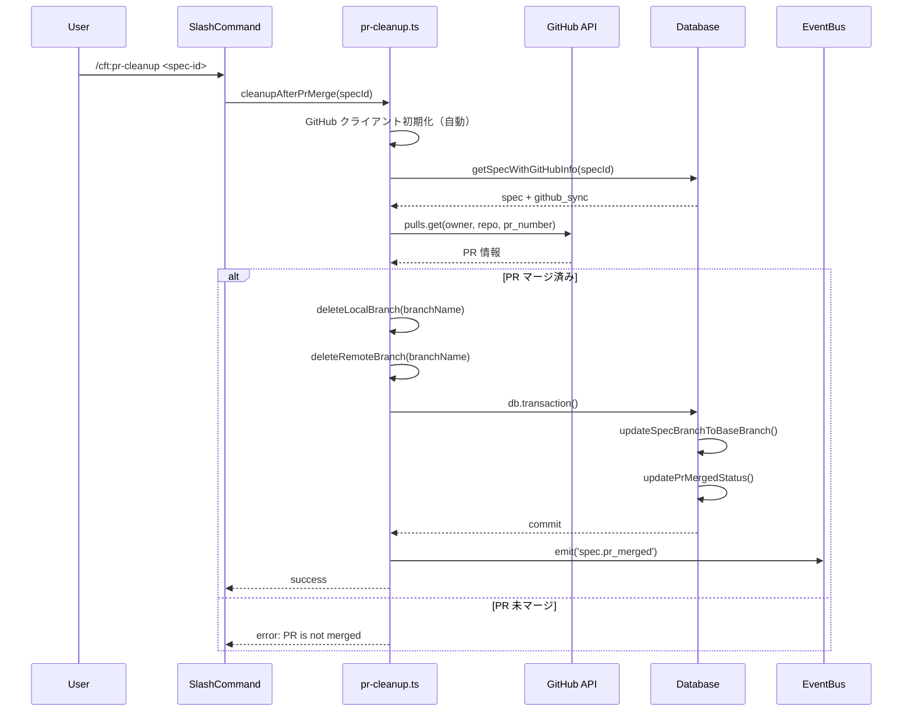

# /cft:pr-cleanup がまともに動作しない

**仕様書 ID:** 8070f99f-201c-4ccb-8137-5765afad06b3
**フェーズ:** design
**作成日時:** 2025/11/23 19:42:10
**更新日時:** 2025/11/23 20:10:57

---

## 1. 背景と目的

### 背景

`/cft:pr-cleanup` コマンドは、PR マージ後の後処理（ブランチ削除、データベース更新）を自動化するコマンドだが、以下の問題により正常に動作しないケースが報告されている:

**主要な問題点:**
1. **GitHubクライアントの初期化エラー**: `GitHub client not initialized. Call initGitHubClient() first.` エラーが発生
   - 原因: `getGitHubClient()` 呼び出し時にグローバルインスタンスが未初期化
   - 他のコマンド（例: `pull-request.ts`）では環境変数から自動初期化するフォールバック処理があるが、`pr-cleanup.ts` にはこの処理がない

2. **GitHub設定の不整合**: 環境変数（`GITHUB_OWNER`, `GITHUB_REPO`）のみをサポートし、`.cc-craft-kit/config.json` の設定を読み込まない
   - `/cft:github-init` コマンドは `config.json` に設定を保存するが、`pr-cleanup.ts` はこれを参照しない

3. **エラーメッセージの不親切**: 失敗時にユーザーに次のアクションを提示しない

### 目的

`/cft:pr-cleanup` コマンドを安定して動作させるため、以下を実現する:

1. **GitHubクライアントの自動初期化**: 未初期化時に環境変数または `config.json` から自動的に初期化
2. **設定読み込みの統一**: 環境変数と `config.json` の両方から GitHub 設定を取得
3. **エラーメッセージの改善**: 失敗時にユーザーに具体的な解決策を提示
4. **単体テストの追加**: PR クリーンアップ処理の信頼性を保証

**設計原則:**
- **プロンプトファースト**: スラッシュコマンド(.md)でできることはプロンプトで実現
- **スキル/サブエージェント活用**: 複雑な処理は専用ツールに委譲
- **スクリプトは最終手段**: データベース操作、GitHub API 呼び出しなど、TypeScript でしか実現できない処理のみスクリプト化

---

## 2. 対象ユーザー

**主要ユーザー**: cc-craft-kit を使用する開発者

**ユースケース:**
- PR マージ後に手動でブランチを削除する手間を省きたい開発者
- GitHub プロジェクト統合を利用している開発者
- 仕様駆動開発（SDD）フローで PR をマージした後、データベース状態を正しく更新したい開発者

**前提知識:**
- Git の基本操作（ブランチ、PR）
- cc-craft-kit の基本的な使い方（`/cft:spec-create`, `/cft:spec-phase`）
- GitHub 統合の設定（`/cft:github-init` の実行）

---

## 3. 受け入れ基準

### 必須要件

- [ ] `/cft:pr-cleanup <spec-id>` を実行した際、GitHub クライアントが未初期化でもエラーにならず、自動的に初期化される
- [ ] 環境変数（`GITHUB_TOKEN`, `GITHUB_OWNER`, `GITHUB_REPO`）が設定されている場合、それらを優先的に使用する
- [ ] 環境変数が未設定の場合、`.cc-craft-kit/config.json` から GitHub 設定を読み込む
- [ ] PR がマージ済みの場合、ローカルブランチとリモートブランチの両方を削除する
- [ ] データベースの `specs.branch_name` を PR のベースブランチに更新する
- [ ] データベースの `github_sync.pr_merged_at` にマージ日時を記録する
- [ ] `spec.pr_merged` イベントを発火する

### 機能要件

- [ ] PR がまだマージされていない場合、警告メッセージを表示し、処理を中断する
- [ ] ブランチ削除に失敗した場合（既に削除済み、保護ブランチなど）、警告を表示するがエラーにはしない
- [ ] GitHub API 呼び出しに失敗した場合、具体的なエラーメッセージとユーザーアクションを提示する
- [ ] データベーストランザクション内で複数の更新処理を実行し、一部失敗時にはロールバックする
- [ ] ログレベル（debug, info, warn, error）を適切に使い分け、処理の進捗を記録する

### 非機能要件

- [ ] 処理時間: GitHub API 呼び出しとブランチ削除を含めて 5 秒以内に完了する
- [ ] セキュリティ: GitHub トークンをログやエラーメッセージに含めない
- [ ] 保守性: 既存の `pull-request.ts`, `spec/delete.ts` の実装パターンを踏襲し、コードの一貫性を保つ
- [ ] テストカバレッジ: 単体テストで主要な処理パスをカバーし、80% 以上のカバレッジを達成する
- [ ] エラーハンドリング: 想定されるエラー（未初期化、設定不足、ネットワークエラー）を適切に処理し、ユーザーに次のアクションを提示する

---

## 4. 制約条件

### 技術的制約

1. **TypeScript strict mode**: すべての型チェックを厳格に実施し、`any` 型は禁止
2. **データベース接続**: 必ず `getDatabase()` を使用し、カスタムパスは指定しない
3. **GitHub API クライアント**: シングルトンパターンで管理（`getGitHubClient()` または自動初期化）
4. **トランザクション管理**: データベース更新は必ずトランザクション内で実行
5. **Git 操作**: 同期実行（`execSync`）を使用し、エラー時も処理を継続
6. **プロンプトファースト原則**: スラッシュコマンド(.md)でできることはプロンプトで実現

### 依存関係の制約

- **Octokit**: GitHub REST API v3（認証、レート制限管理）
- **Kysely**: SQLite3 ORM（パラメータ化クエリ）
- **EventBus**: `EventEmitter2` ベースのイベント駆動処理
- **Node.js**: 18 以上
- **Git**: ローカルに Git CLI がインストールされている前提

### 設計上の制約

- **既存実装との一貫性**: `pull-request.ts`, `spec/delete.ts` の実装パターンを踏襲
- **エラーハンドリング**: 標準エラークラス（`src/core/errors/`）を使用
- **セキュリティ**: 認証情報（GitHub トークン）をログやエラーメッセージに含めない
- **後方互換性**: 既存の `/cft:pr-cleanup` の呼び出しインターフェース（引数、出力形式）を維持

---

## 5. 依存関係

### 内部モジュール

- **`src/integrations/github/client.ts`**: GitHub クライアントの初期化・取得
  - `initGitHubClient(config)`: 新しい GitHub クライアントを初期化
  - `getGitHubClient()`: グローバルインスタンスを取得（未初期化時にエラー）
- **`src/integrations/github/config.ts`**: GitHub 設定の読み込み
  - `getGitHubConfig()`: 環境変数から GitHub 設定を取得
- **`src/core/database/manager.ts`**: データベース接続管理
  - `getDatabase()`: データベースインスタンスを取得
- **`src/core/database/helpers.ts`**: データベーストランザクション処理
  - `inTransaction()`: トランザクション内で処理を実行
- **`src/core/events/event-bus.ts`**: イベント駆動処理
  - `getEventBusAsync()`: EventBus インスタンスを取得
  - `spec.pr_merged` イベント定義
- **`src/core/workflow/branch-cleanup.ts`**: ブランチ削除処理
  - `cleanupBranches()`: ローカルとリモートのブランチ削除

### 外部 API

- **GitHub REST API v3**: PR 情報の取得（`client.rest.pulls.get()`）
- **Git CLI**: ブランチ削除（`git branch -D`, `git push origin --delete`）

### 設定ファイル

- **`.cc-craft-kit/config.json`**: GitHub 統合設定（`/cft:github-init` で作成）
- **`.env`**: 環境変数（`GITHUB_TOKEN`, `GITHUB_OWNER`, `GITHUB_REPO`）

### 関連仕様書

- **spec d3adac1c-70de-4f54-93b8-3cf69c8368bd**: PR マージ後のクリーンアップ（元の仕様書）
- **GitHub 統合機能**: `/cft:github-init`, `/cft:github-issue-create`, `/cft:github-sync`

### データベーススキーマ

- **`specs` テーブル**:
  - `branch_name`: PR マージ後にベースブランチに更新
- **`github_sync` テーブル**:
  - `pr_number`: PR 番号
  - `pr_url`: PR URL
  - `pr_merged_at`: マージ日時（この処理で記録）

---

## 6. 参考情報

### 参考実装

- **`src/integrations/github/pull-request.ts:119-134`**: GitHub クライアントの自動初期化パターン
  ```typescript
  try {
    client = getGitHubClient();
  } catch {
    const token = process.env.GITHUB_TOKEN;
    if (!token) {
      return { success: false, error: 'GitHub client not initialized' };
    }
    const { initGitHubClient } = await import('./client.js');
    client = initGitHubClient({ token });
  }
  ```
- **`src/integrations/github/pull-request.ts:136-148`**: 環境変数と `config.json` からの設定読み込み
- **`src/commands/spec/delete.ts:42-65`**: `config.json` から GitHub 設定を読み込む関数
- **`src/core/workflow/branch-cleanup.ts`**: 保護ブランチチェックとブランチ削除処理

### 関連ドキュメント

- **CLAUDE.md**: プロジェクト規約とコーディングルール
- **docs/ARCHITECTURE.md**: アーキテクチャ設計とモジュール構成
- **src/integrations/github/README.md**: GitHub 統合機能の概要（存在する場合）

### 既知の問題

- **Issue #XXX**: `/cft:pr-cleanup` が `GitHub client not initialized` エラーで失敗する
- **Issue #YYY**: `config.json` の GitHub 設定が読み込まれない

### テスト戦略

- **モック化**: GitHub API 呼び出し、Git 操作は必ずモック化
- **テストデータベース**: `:memory:` モードで SQLite を使用
- **カバレッジ目標**: 80% 以上（主要な処理パスをカバー）
- **テストケース**:
  1. GitHub クライアント自動初期化（環境変数あり/なし）
  2. 設定読み込み（環境変数優先、`config.json` フォールバック）
  3. PR マージ済み/未マージの判定
  4. ブランチ削除成功/失敗（既に削除済み、保護ブランチ）
  5. データベーストランザクション（成功/ロールバック）
  6. イベント発火の確認

---

## 7. 設計詳細

### 7.1. アーキテクチャ設計

**モジュール構成:**

```
src/integrations/github/pr-cleanup.ts (実装対象)
  ├─ src/integrations/github/client.ts (GitHub クライアント管理)
  ├─ src/core/config/github-config.ts (GitHub 設定)
  ├─ src/core/workflow/branch-cleanup.ts (ブランチ削除)
  ├─ src/core/database/helpers.ts (トランザクション)
  └─ src/core/events/event-bus.ts (イベント発火)
```

**処理フロー:**



**設計上の主要変更点:**

1. **GitHub クライアント自動初期化パターンの追加**
   - 現在: `getGitHubClient()` を直接呼び出し（未初期化時にエラー）
   - 変更後: `pull-request.ts` と同様のフォールバック処理を追加
   - 目的: `/cft:github-init` を実行していないユーザーでも環境変数があれば動作

2. **設定読み込みの統一化**
   - 現在: 環境変数（`getGitHubConfig()`）のみ
   - 変更後: 環境変数優先 → `config.json` フォールバック
   - 目的: `/cft:github-init` で設定した内容も参照可能に

3. **エラーメッセージの改善**
   - 現在: エラーオブジェクトのみ
   - 変更後: 具体的な解決策を提示
   - 例: 「GitHub client not initialized. Run `/cft:github-init` or set GITHUB_TOKEN.」

---

### 7.2. データモデル

**影響を受けるテーブル:**

#### specs テーブル

| カラム | 型 | 変更内容 |
|--------|----|------------|
| `branch_name` | TEXT | PR のベースブランチに更新（例: `feature/xxx` → `develop`） |

#### github_sync テーブル

| カラム | 型 | 変更内容 |
|--------|----|------------|
| `pr_merged_at` | TEXT | PR マージ日時を記録（ISO 8601 形式） |

**トランザクション境界:**

```typescript
await db.transaction().execute(async (trx) => {
  // 1. specs.branch_name を更新
  await updateSpecBranchToBaseBranch(trx, specId, baseBranch);

  // 2. github_sync.pr_merged_at を更新
  await updatePrMergedStatus(trx, specId, mergedAt);
});
```

- 両方の更新が原子的に実行される（一部失敗時はロールバック）
- `src/core/database/helpers.ts` のヘルパー関数を使用（既存実装を流用）

---

### 7.3. API の仕様

**GitHub REST API v3:**

```typescript
// PR マージ状態の取得
const response = await client.rest.pulls.get({
  owner: config.owner,
  repo: config.repo,
  pull_number: prNumber,
});

// 使用するフィールド
response.data.merged  // boolean: マージ済みかどうか
response.data.merged_at  // string | null: マージ日時（ISO 8601）
response.data.base.ref  // string: PR のベースブランチ名（例: "develop"）
```

**レート制限:**
- 認証済みリクエスト: 5000 リクエスト/時間
- 本コマンドは 1 PR につき 1 リクエストのみ（問題なし）

**エラーハンドリング:**
- 401: トークンが無効 → 「Invalid GitHub token. Check GITHUB_TOKEN.」
- 403: レート制限超過 → 「GitHub API rate limit exceeded. Try again later.」
- 404: PR が見つからない → 「PR #XXX not found in {owner}/{repo}.」

---

### 7.4. セキュリティ考慮事項

**認証情報の保護:**
- GitHub トークンはログやエラーメッセージに含めない
- `.env` ファイルは `.gitignore` に追加（既存設定を流用）
- `config.json` はローカルリポジトリのみ（`.gitignore` で除外）

**Git 操作のセキュリティ:**
- 保護ブランチ削除の禁止（`isProtectedBranch()` で事前チェック）
- リモートブランチ削除は `--delete` フラグを使用（`--force` は使用しない）

**エラー情報の漏洩防止:**
- GitHub API エラーレスポンスは内部処理のみで使用
- ユーザーには抽象化されたエラーメッセージを返す
- 例: `error.response.data.message` ではなく「PR not found」と表示

---

### 7.5. テスト戦略

**単体テストの範囲:**

1. **GitHub クライアント自動初期化**
   - モック: `getGitHubClient()` をスタブして例外を投げる
   - 検証: 環境変数から `initGitHubClient()` が呼ばれること
   - ケース: トークンあり/なし

2. **設定読み込み**
   - モック: `process.env.GITHUB_OWNER`, `process.env.GITHUB_REPO`
   - 検証: 環境変数優先、`config.json` フォールバック
   - ケース: 環境変数あり、環境変数なし + config あり、両方なし

3. **PR マージ状態の確認**
   - モック: `client.rest.pulls.get()`
   - 検証: マージ済み/未マージの判定が正しいこと
   - ケース: `merged: true`, `merged: false`

4. **ブランチ削除**
   - モック: `execSync` をスタブ
   - 検証: ローカル・リモート両方が呼ばれること
   - ケース: 削除成功、既に削除済み、保護ブランチ

5. **トランザクション処理**
   - モック: インメモリデータベース（`:memory:`）
   - 検証: トランザクションコミット/ロールバック
   - ケース: 正常終了、途中エラー（ロールバック）

6. **イベント発火**
   - モック: `getEventBusAsync()` をスタブ
   - 検証: `spec.pr_merged` イベントが発火されること
   - ケース: イベント発火成功、イベント発火失敗（警告のみ）

**テストファイル構成:**

```
tests/integrations/github/pr-cleanup.test.ts
  describe('cleanupAfterPrMerge')
    ├─ it('should auto-initialize GitHub client from env vars')
    ├─ it('should fail if GitHub client cannot be initialized')
    ├─ it('should read config from env vars first')
    ├─ it('should fallback to config.json if env vars are missing')
    ├─ it('should succeed when PR is merged')
    ├─ it('should fail when PR is not merged')
    ├─ it('should delete local and remote branches')
    ├─ it('should warn when branch is already deleted')
    ├─ it('should throw error when deleting protected branch')
    ├─ it('should update database in transaction')
    ├─ it('should rollback transaction on error')
    ├─ it('should emit spec.pr_merged event')
    └─ it('should continue even if event emission fails')
```

**カバレッジ目標:**
- ライン: 80% 以上
- ブランチ: 75% 以上（エラーパスを含む）
- 関数: 100%（すべての公開関数をテスト）
