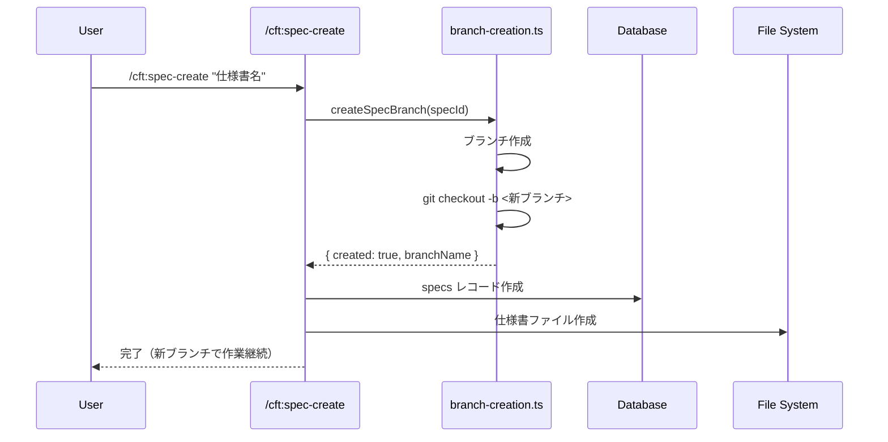
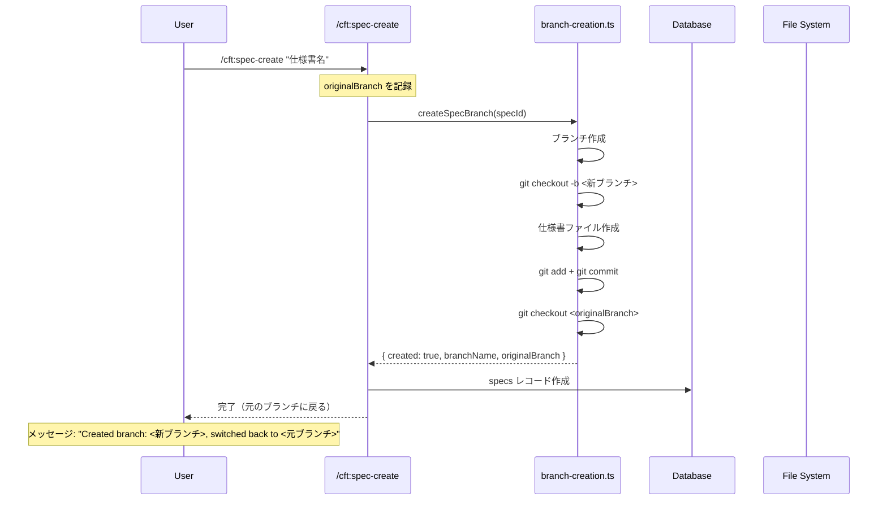

# /cft:spec-create 時のブランチ作成運用仕様の見直し

**仕様書 ID:** 910e63ad-d89e-46ea-8f2a-326fae1c0870
**フェーズ:** completed
**作成日時:** 2025/11/22 15:30:42
**更新日時:** 2025/11/22 15:55:39

---

## 1. 背景と目的

### 背景

現在の `/cft:spec-create` コマンドは、実行時に新しいブランチを作成し、そのブランチに切り替えた状態で仕様書を作成します。しかし、以下の課題があります。

#### 現在の課題

1. **ブランチ切り替え忘れによるリスク**
   - ブランチ作成後、そのブランチで作業を続けることが前提となっている
   - 開発者がブランチを切り替え忘れると、意図しないブランチでコミットしてしまう可能性がある

2. **保護ブランチでの実行制限**
   - main や develop ブランチで実行した場合、保護ブランチに直接コミットするリスクがある
   - 現在は自動的に `feature/spec-` プレフィックス付きブランチを作成しているが、実行後も新しいブランチに留まる

3. **データベース整合性の懸念**
   - ブランチ作成に失敗した場合、仕様書ファイルとデータベースレコードが不整合になる可能性がある
   - ロールバック処理が不完全な場合、孤立したレコードやファイルが残る

#### 改善の方向性

- **ブランチ作成後、元のブランチに自動的に戻る**仕様に変更することで、意図しないブランチでの作業を防止
- どのブランチで `/cft:spec-create` を実行しても問題なく動作する柔軟性を確保
- データベースとファイルシステムの整合性を維持するため、エラー時のロールバック処理を強化

### 目的

- `/cft:spec-create` コマンドを任意のブランチで実行可能にし、ブランチ運用の柔軟性を向上させる
- 保護ブランチ (main/develop) での直接作業を防ぎ、誤操作によるリスクを低減する
- ブランチ作成後の挙動を明確化し、開発者の混乱を防ぐ
- データベース整合性を維持し、ブランチとデータベースレコードの一貫性を保証する

---

## 2. 対象ユーザー

- cc-craft-kit を使用するすべての開発者
- 特に、保護ブランチ (main/develop) からの仕様書作成を試みるユーザー
- ブランチ切り替えの手間を削減したい開発者

---

## 3. 受け入れ基準

### 必須要件

- [ ] main ブランチから `/cft:spec-create` を実行した場合、`feature/spec-<短縮ID>` ブランチが自動作成される
- [ ] develop ブランチから `/cft:spec-create` を実行した場合、`feature/spec-<短縮ID>` ブランチが自動作成される
- [ ] feature/* ブランチから `/cft:spec-create` を実行した場合、`spec/<短縮ID>` ブランチが自動作成される
- [ ] ブランチ作成後、元のブランチに自動的に戻る
- [ ] データベースレコードの `branch_name` に作成されたブランチ名が正しく記録される
- [ ] ブランチ作成に失敗した場合、仕様書ファイルとデータベースレコードが適切にロールバックされる

### 機能要件

- [ ] 保護ブランチのリストは環境変数 `PROTECTED_BRANCHES` でカスタマイズ可能
- [ ] カスタムブランチ名を指定した場合、`spec/<短縮ID>-<カスタム名>` または `feature/spec-<短縮ID>-<カスタム名>` が作成される
- [ ] ブランチ作成後、コンソールに「Created branch: <ブランチ名>, switched back to <元のブランチ>」のようなメッセージを表示する

### 非機能要件

- [ ] ブランチ作成処理は 5 秒以内に完了すること
- [ ] Git コマンド実行時のエラーハンドリングが適切に実装されていること
- [ ] 既存の単体テスト・E2E テストがすべて合格すること
- [ ] 新しい挙動に対応する単体テストが追加されていること

---

## 4. 制約条件

### 技術的制約

- Git リポジトリが初期化されている環境でのみ動作する
- 環境変数 `PROTECTED_BRANCHES` が設定されていない場合、デフォルトで `main,develop` が保護対象となる
- ブランチ名のサニタイゼーションにより、16 進数以外の文字は削除される

### 運用制約

- ブランチ作成時に同名のブランチが既に存在する場合、エラーとなる（上書きしない）
- 元のブランチに戻る際、未コミット変更がある場合でもブランチ切り替えを強制しない（Git のデフォルト挙動に従う）

---

## 5. 依存関係

### 関連仕様書

- (既存の関連仕様書があれば記載)

### 関連モジュール

- `src/core/git/branch-creation.ts` - ブランチ作成ロジック
- `src/core/git/branch-cache.ts` - ブランチキャッシュ機構
- `src/commands/spec/create.ts` - 仕様書作成コマンド
- `src/core/database/connection.ts` - データベース接続管理

### 環境変数

- `PROTECTED_BRANCHES` - 保護対象ブランチのカンマ区切りリスト（デフォルト: `main,develop`）

---

## 6. 参考情報

- [CLAUDE.md#ブランチ管理](CLAUDE.md#ブランチ管理) - 既存のブランチ管理仕様
- GitHub Flow + develop ブランチモデル - プロジェクトのブランチ戦略
- `src/core/git/branch-creation.ts` - 既存のブランチ作成実装
- `tests/core/git/branch-creation.test.ts` - 既存の単体テスト

---

## 7. 設計

### 7.1 処理フロー

#### 現在の動作（変更前）



**問題点**: 新ブランチに留まるため、開発者が意図しないブランチでコミットするリスクがある。

#### 新しい動作（変更後）



**改善点**:

- ブランチ作成後、元のブランチに自動的に戻る
- 新ブランチで仕様書ファイルをコミットしてから戻るため、コミット漏れを防止
- 開発者が意図しないブランチで作業するリスクを排除

### 7.2 実装方針

#### 7.2.1 ブランチ作成処理の変更

**変更対象ファイル**: `src/core/git/branch-creation.ts`

**現在の処理**:

```typescript
// 4. ブランチ作成
execSync(`git checkout -b ${branchName}`, { stdio: 'pipe' });

// 5. ブランチ作成の検証
currentBranch = execSync('git rev-parse --abbrev-ref HEAD', { encoding: 'utf-8' }).trim();

return {
  created: true,
  branchName,
  originalBranch,
};
```

**新しい処理**:

```typescript
// 4. ブランチ作成
execSync(`git checkout -b ${branchName}`, { stdio: 'pipe' });

// 5. ブランチ作成の検証
currentBranch = execSync('git rev-parse --abbrev-ref HEAD', { encoding: 'utf-8' }).trim();

// 6. 元のブランチに戻る（追加）
try {
  execSync(`git checkout ${originalBranch}`, { stdio: 'pipe' });
} catch (error) {
  // エラー時は警告を出すが、処理は継続
  console.warn(`Warning: Failed to switch back to ${originalBranch}: ${error}`);
}

return {
  created: true,
  branchName,
  originalBranch,
};
```

#### 7.2.2 仕様書作成コマンドの変更

**変更対象ファイル**: `src/commands/spec/create.ts`

**現在の処理**:

```typescript
// ブランチ作成
const branchResult = createSpecBranch(id, options.branchName);
if (branchResult.created) {
  console.log(`Created new branch: ${branchResult.branchName}`);
}

// データベースレコード作成
await db.insertInto('specs').values({ ... }).execute();

// ファイル作成
writeFileSync(specPath, content);
```

**新しい処理**:

```typescript
// ブランチ作成
const branchResult = createSpecBranch(id, options.branchName);
if (branchResult.created) {
  console.log(`Created branch: ${branchResult.branchName}, switched back to ${branchResult.originalBranch}`);
}

// データベースレコード作成（変更なし）
await db.insertInto('specs').values({ ... }).execute();

// ファイル作成（変更なし）
writeFileSync(specPath, content);
```

**変更点**:

- メッセージ表示のみ変更（「switched back to」を追加）
- `branch_name` には作成されたブランチ名を記録（元のブランチではない）

#### 7.2.3 コミット処理の追加

**問題**: 仕様書ファイルを作成後、ブランチを切り替えると未コミット変更が発生する。

**解決策**: 新ブランチで仕様書ファイルを自動コミットしてから元のブランチに戻る。

**実装場所**: `src/core/git/branch-creation.ts` または `src/commands/spec/create.ts`

**実装方針**:

1. **パターンA**: `createSpecBranch()` にファイルパスを渡し、ブランチ作成内でコミット
   - メリット: ブランチ作成とコミットが一体化、ロールバックが容易
   - デメリット: `createSpecBranch()` の責務が増える

2. **パターンB**: `create.ts` でファイル作成後、別途コミット処理を実行
   - メリット: 関心の分離が明確
   - デメリット: エラー時のロールバックが複雑

**推奨**: パターン A を採用（ブランチ作成とコミットを一体化）

**修正後の `createSpecBranch()` シグネチャ**:

```typescript
export function createSpecBranch(
  specId: string,
  customBranchName?: string,
  options?: {
    /** コミットするファイルパス（省略時はコミットなし） */
    commitFile?: string;
    /** コミットメッセージ（省略時はデフォルトメッセージ） */
    commitMessage?: string;
  }
): BranchCreationResult
```

### 7.3 データベース設計

**変更なし**。`specs` テーブルの `branch_name` カラムには、作成されたブランチ名を記録する。

```sql
-- specs テーブル（変更なし）
CREATE TABLE specs (
  id TEXT PRIMARY KEY,
  name TEXT NOT NULL,
  description TEXT,
  phase TEXT NOT NULL,
  branch_name TEXT NOT NULL,  -- 作成されたブランチ名（例: "feature/spec-910e63ad"）
  created_at TEXT NOT NULL,
  updated_at TEXT NOT NULL
);
```

**注意**: `branch_name` は作成されたブランチ名を記録し、現在のブランチ名ではない。

### 7.4 エラーハンドリング

#### 7.4.1 ブランチ切り替え失敗時

**シナリオ**: 元のブランチに戻る際、Git エラーが発生する。

**対処**:

- 警告メッセージを表示（例: `Warning: Failed to switch back to develop`）
- 仕様書作成は成功とみなす（ブランチは作成済み、データベースレコードも作成済み）
- ユーザーに手動でブランチを切り替えるよう案内

```typescript
try {
  execSync(`git checkout ${originalBranch}`, { stdio: 'pipe' });
} catch (error) {
  console.warn(`⚠️  Failed to switch back to ${originalBranch}`);
  console.warn(`   Please manually run: git checkout ${originalBranch}`);
  // 処理は継続
}
```

#### 7.4.2 コミット失敗時

**シナリオ**: 仕様書ファイルのコミットに失敗する。

**対処**:

- エラーメッセージを表示
- ブランチ削除とデータベースロールバックを実行
- 仕様書作成を失敗とみなす

```typescript
try {
  execSync(`git add ${specFilePath}`, { stdio: 'pipe' });
  execSync(`git commit -m "feat: 仕様書を作成"`, { stdio: 'pipe' });
} catch (error) {
  // ブランチ削除
  execSync(`git checkout ${originalBranch}`, { stdio: 'ignore' });
  execSync(`git branch -D ${branchName}`, { stdio: 'ignore' });

  throw new Error(`仕様書ファイルのコミットに失敗しました: ${error}`);
}
```

### 7.5 テスト戦略

#### 7.5.1 単体テスト

**テストファイル**: `tests/core/git/branch-creation.test.ts`

**追加テストケース**:

1. **ブランチ作成後、元のブランチに戻ることを確認**

   ```typescript
   it('should switch back to original branch after creation', () => {
     const originalBranch = 'develop';
     const result = createSpecBranch(specId, 'test-branch');

     expect(result.created).toBe(true);
     expect(getCurrentBranch()).toBe(originalBranch); // 元のブランチに戻っている
   });
   ```

2. **コミットが正常に実行されることを確認**

   ```typescript
   it('should commit spec file in new branch', () => {
     const result = createSpecBranch(specId, 'test-branch', {
       commitFile: '/path/to/spec.md',
       commitMessage: 'feat: 仕様書を作成',
     });

     expect(result.created).toBe(true);
     // git log で最新コミットを確認
   });
   ```

3. **ブランチ切り替え失敗時も処理が継続することを確認**

   ```typescript
   it('should continue even if switching back fails', () => {
     // execSync のモックでエラーをスロー
     const result = createSpecBranch(specId, 'test-branch');

     expect(result.created).toBe(true);
     // 警告メッセージが表示されることを確認
   });
   ```

#### 7.5.2 E2E テスト

**テストファイル**: `tests/e2e/spec-creation-branch-workflow.test.ts`

**テストシナリオ**:

1. **main ブランチから実行**
   - `feature/spec-` プレフィックス付きブランチが作成される
   - ブランチ作成後、main に戻る
   - データベースレコードの `branch_name` に作成されたブランチ名が記録される

2. **develop ブランチから実行**
   - `feature/spec-` プレフィックス付きブランチが作成される
   - ブランチ作成後、develop に戻る

3. **feature/* ブランチから実行**
   - `spec/` プレフィックス付きブランチが作成される
   - ブランチ作成後、元の feature ブランチに戻る

### 7.6 マイグレーション不要

データベーススキーマに変更はないため、マイグレーションは不要。

### 7.7 ドキュメント更新

**更新対象**:

- `CLAUDE.md#ブランチ管理` - 新しい動作を追記
- `src/slash-commands/spec-create.md` - 動作説明を更新

**追記内容**:

```markdown
## ブランチ作成後の動作（v0.3.0 以降）

仕様書作成時にブランチが自動作成されますが、作成後は**元のブランチに自動的に戻ります**。

- ブランチは作成され、仕様書ファイルがコミットされた状態で残ります
- 開発者が意図しないブランチで作業するリスクを防止
- 実装を開始する際は、手動で作成されたブランチに切り替えてください

**実装開始時**:

```bash
git checkout feature/spec-910e63ad
```

---

## 8. 未解決の課題

### 8.1 仕様書ファイルのコミットタイミング

**問題**: 現在の設計では、ブランチ作成時に仕様書ファイルが未作成のため、コミットできない。

**検討事項**:

- ファイル作成を `createSpecBranch()` 内に移動するか
- コミット処理を `create.ts` に残し、別途実行するか

**推奨**: ファイル作成は `create.ts` の責務として残し、コミット処理のみ `createSpecBranch()` に委譲する。

### 8.2 コミット漏れ防止の検証

**問題**: ブランチ切り替え前にコミットが確実に実行されるか、E2E テストで検証する必要がある。

**検証方法**:

- E2E テストで `git log` を実行し、最新コミットの存在を確認
- コミットメッセージが期待通りであることを確認

---

## 9. 実装タスクリスト

### 9.1 コア機能の実装

- [ ] **タスク 1**: `src/core/git/branch-creation.ts` にブランチ切り替え処理を追加
  - `createSpecBranch()` 関数の最後に `git checkout <originalBranch>` を実行
  - エラー時は警告メッセージを表示し、処理を継続
  - 実装ファイル: `src/core/git/branch-creation.ts:152-157`

- [ ] **タスク 2**: `src/commands/spec/create.ts` のメッセージ表示を更新
  - 「Created new branch」を「Created branch: <ブランチ名>, switched back to <元のブランチ>」に変更
  - 実装ファイル: `src/commands/spec/create.ts:154`

- [ ] **タスク 3**: ブランチ切り替え失敗時のエラーハンドリングを実装
  - `try-catch` で `git checkout` をラップ
  - 失敗時は警告メッセージを表示し、処理を継続
  - 実装ファイル: `src/core/git/branch-creation.ts:152-157`

### 9.2 テストの追加

- [ ] **タスク 4**: 単体テストを追加（ブランチ切り替え確認）
  - テストケース: ブランチ作成後、元のブランチに戻ることを確認
  - テストケース: ブランチ切り替え失敗時も処理が継続することを確認
  - テストファイル: `tests/core/git/branch-creation.test.ts`

- [ ] **タスク 5**: E2E テストを追加（各ブランチからの実行確認）
  - テストシナリオ: main ブランチから実行した場合の動作確認
  - テストシナリオ: develop ブランチから実行した場合の動作確認
  - テストシナリオ: feature/* ブランチから実行した場合の動作確認
  - テストファイル: `tests/e2e/spec-creation-branch-workflow.test.ts`

### 9.3 ドキュメントの更新

- [ ] **タスク 6**: `CLAUDE.md` のドキュメントを更新
  - 「ブランチ管理」セクションに新しい動作を追記
  - 実装開始時のブランチ切り替え手順を追加
  - 更新ファイル: `CLAUDE.md`

- [ ] **タスク 7**: `src/slash-commands/spec-create.md` のドキュメントを更新
  - ブランチ作成後の動作説明を更新
  - 「元のブランチに自動的に戻る」旨を明記
  - 更新ファイル: `src/slash-commands/spec-create.md`

### 9.4 実装の優先順位

1. **最優先**: タスク 1, 2, 3（コア機能の実装）
2. **高優先**: タスク 4, 5（テストの追加）
3. **中優先**: タスク 6, 7（ドキュメント更新）

### 9.5 依存関係

- タスク 2 はタスク 1 の完了後に実行可能
- タスク 4, 5 はタスク 1, 2, 3 の完了後に実行可能
- タスク 6, 7 はタスク 1, 2, 3 の完了後に実行可能
