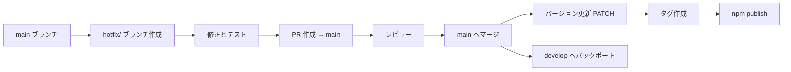

# このリポジトリのブランチ戦略を作成

**仕様書 ID:** 989aa48d-749a-4826-800b-3b6b76a303e0
**フェーズ:** completed
**作成日時:** 2025/11/19 22:51:45
**更新日時:** 2025/11/19 23:37:37

---

## 1. 背景と目的

### 背景

cc-craft-kit プロジェクトでは、現在ブランチ戦略が明確に定義されていません。CLAUDE.md には基本的なブランチ命名規則（`feature/`, `bugfix/`, `refactor/`）が記載されていますが、以下の点が不明確です。

- メインブランチの運用方針（main ブランチのみか、develop ブランチも使用するか）
- PR のマージ戦略（Merge Commit, Squash, Rebase）
- リリースフロー（タグ付け、バージョニング）
- ホットフィックスの対応方法
- ブランチ保護ルールの設定

### 目的

1. 明確なブランチ戦略を策定し、開発フローを標準化する
2. CLAUDE.md に「Git ワークフロー基本方針」セクションを拡充し、チーム全体で共有可能な状態にする
3. GitHub リポジトリのブランチ保護設定を推奨する
4. cc-craft-kit の自動 Git コミット機能と整合性のある戦略を確立する

---

## 2. 対象ユーザー

- cc-craft-kit の開発者（コントリビューター）
  - コアチームメンバー
  - 外部コントリビューター
- Claude Code を使用して cc-craft-kit を利用する開発者
  - ドッグフーディング環境での開発者
- GitHub リポジトリ管理者（ブランチ保護ルールを設定する担当者）

---

## 3. 受け入れ基準

### 必須要件

- [ ] CLAUDE.md に「Git ワークフロー基本方針」セクションを拡充する
- [ ] ブランチ戦略（メインブランチ運用方針、PR マージ戦略、リリースフロー）を明記する
- [ ] ブランチ命名規則を体系的に整理する
- [ ] ブランチ保護ルールの推奨設定を記載する

### 機能要件

- [ ] メインブランチ運用方針を決定する（main のみか、main + develop か）
- [ ] PR のマージ戦略を決定する（Merge Commit / Squash / Rebase）
- [ ] リリースフロー（バージョニング、タグ付け）を定義する
  - npm バージョン管理（package.json）
  - Git タグ付け規則（セマンティックバージョニング）
  - リリースノート自動生成の有無
- [ ] ホットフィックスフローを定義する
  - 緊急修正時のブランチ戦略（hotfix/ ブランチの使用）
  - main ブランチへの直接マージ可否
- [ ] cc-craft-kit の自動 Git コミット機能との整合性を確認する
  - completed フェーズ移行時の自動コミットがブランチ戦略と整合するか検証

### 非機能要件

- [ ] 既存のコミットメッセージ規約（Conventional Commits）と整合性を保つ
  - 検証方法: CLAUDE.md のコミットメッセージ例を確認し、新しいブランチ戦略で矛盾がないことを確認
- [ ] GitHub Actions CI/CD ワークフローと連携可能な設計にする
  - 検証方法: `.github/workflows/*.yml` のブランチトリガー設定を確認し、必要に応じて修正
- [ ] ブランチ保護ルール設定により、main ブランチへの直接 push を防止する
  - 検証方法: GitHub リポジトリ設定で「Require pull request before merging」を有効化し、動作確認

---

## 4. 制約条件

- 既存のリポジトリ構造を維持する
  - main ブランチをデフォルトブランチとして継続使用する
  - 既存のコミット履歴を保持する
  - 既存のタグ・リリースを維持する
- cc-craft-kit の自動 Git コミット機能（フェーズ変更時のコミット）と整合性を保つ
- GitHub の無料プラン範囲内で実現可能なブランチ保護設定とする
- 既存の Conventional Commits 規約を継続利用する

---

## 5. 依存関係

### 影響を受けるコンポーネント

- **CLAUDE.md** の「Git ワークフロー基本方針」セクション
  - 影響: ドキュメント更新が必要
- **cc-craft-kit の自動 Git コミット機能** (`src/core/workflow/git-integration.ts`)
  - 影響: ブランチ戦略変更に伴うコード修正の可能性
- **GitHub Actions ワークフロー** (`.github/workflows/*.yml`)
  - 影響: CI/CD パイプラインのブランチトリガー設定変更の可能性
- **GitHub リポジトリ設定**
  - 影響: ブランチ保護ルール、デフォルトブランチ設定変更の可能性

### 前提条件

- 既存の main ブランチが安定していること
- GitHub リポジトリの管理者権限があること

---

## 6. 参考情報

- [Git Flow](https://nvie.com/posts/a-successful-git-branching-model/) - Vincent Driessen 氏の Git ブランチモデル
- [GitHub Flow](https://docs.github.com/en/get-started/using-github/github-flow) - GitHub 公式のシンプルなワークフロー
- [GitLab Flow](https://about.gitlab.com/topics/version-control/what-is-gitlab-flow/) - GitLab のブランチ戦略
- [Trunk Based Development](https://trunkbaseddevelopment.com/) - trunk-based な開発スタイル
- [Conventional Commits](https://www.conventionalcommits.org/) - コミットメッセージ規約
- [GitHub Branch Protection Rules](https://docs.github.com/en/repositories/configuring-branches-and-merges-in-your-repository/managing-protected-branches/about-protected-branches)
  \- GitHub ブランチ保護設定

---

## 7. 設計

### 7.1 ブランチ戦略の選択

cc-craft-kit プロジェクトに最適なブランチ戦略を選択するため、主要なブランチモデルを比較検討します。

#### ブランチモデルの比較

| モデル | メリット | デメリット | cc-craft-kit への適合性 |
|---|---|---|---|
| **GitHub Flow** | シンプル、継続的デプロイ向き | リリースバージョン管理が弱い | ⭐⭐⭐ 推奨 |
| **Git Flow** | リリース管理が厳格 | 複雑、小規模プロジェクトには過剰 | ⭐ |
| **GitLab Flow** | 環境ベースのデプロイ管理 | cc-craft-kit はCLIツールのためステージング環境不要 | ⭐⭐ |
| **Trunk Based Development** | 超高速リリース、CI/CD最適化 | 大規模チーム向け、テストカバレッジ必須 | ⭐⭐ |

#### 選択: GitHub Flow + develop ブランチ

**理由:**

1. **現在と未来のバランス**: 1 名開発でもシンプルに運用可能、複数コントリビューターが参加しても対応可能
2. **リリース管理の強化**: main ブランチは常に安定版、develop ブランチで統合テスト実施
3. **並行開発の促進**: 複数の feature ブランチを develop で統合し、コンフリクトを早期検出
4. **リリース柔軟性**: develop → main へのマージがリリースポイントとなり、タイミングを調整可能
5. **自動コミット機能との整合性**: feature ブランチで自動コミット実行 → develop へ PR → main にリリース

**Git Flow との違い:**

- release ブランチは不要（develop からの直接マージで十分）
- hotfix は main から派生し、develop と main の両方にマージ
- Git Flow より簡略化されているが、リリース管理は維持

### 7.2 ブランチ構成

#### メインブランチ

| ブランチ | 役割 | 保護レベル | デプロイ |
|---|---|---|---|
| **main** | 本番リリース済みの安定版コード | 🔒 最高 | npm publish（リリース済み） |
| **develop** | 次期リリース候補の統合ブランチ | 🔒 高 | なし（統合テスト用） |

**main ブランチの運用方針:**

- 常にテストが通り、ビルドが成功する状態を維持
- 直接 push は禁止（ブランチ保護ルール）
- develop からの PR マージのみ許可（リリース時）
- リリース時は main ブランチから Git タグを作成

**develop ブランチの運用方針:**

- 次期リリース向けの機能を統合するブランチ
- 直接 push は禁止（ブランチ保護ルール）
- 各作業ブランチ（feature/fix/refactor/docs/chore）からの PR マージのみ許可
- CI/CD パイプラインで自動テスト実行
- 定期的に main ブランチにマージしてリリース

#### 作業ブランチ

| ブランチプレフィックス | 用途 | 命名例 | ベースブランチ |
|---|---|---|---|
| `feature/` | 新機能開発 | `feature/add-backlog-integration` | **develop** |
| `fix/` または `bugfix/` | バグ修正 | `fix/database-connection-leak` | **develop** |
| `hotfix/` | 緊急修正（本番障害対応） | `hotfix/critical-security-patch` | **main** |
| `refactor/` | リファクタリング | `refactor/simplify-event-bus` | **develop** |
| `docs/` | ドキュメント更新のみ | `docs/update-architecture-guide` | **develop** |
| `chore/` | 雑務（依存関係更新など） | `chore/update-dependencies` | **develop** |

**ブランチ命名規則:**

- 小文字のケバブケース（kebab-case）を使用
- 簡潔で内容が分かりやすい名前をつける
- Issue 番号がある場合は含める（例: `feature/215-branch-strategy`）

### 7.3 PR マージ戦略

#### 推奨マージ戦略: Squash and Merge

**理由:**

1. **コミット履歴の整理**: 作業中の細かいコミットをまとめて、main ブランチの履歴を読みやすく保つ
2. **Conventional Commits との整合性**: PR タイトルを Conventional Commits 形式にすることで、自動リリースノート生成が可能
3. **リバート容易性**: 1 つの PR = 1 つのコミットのため、問題があった場合のロールバックが簡単

**マージ時の手順:**

1. PR タイトルを Conventional Commits 形式で記述
   - 例: `feat: Add Backlog integration support`
   - 例: `fix: Resolve database connection leak`
2. Squash and Merge 実行
3. ブランチ削除（GitHub 設定で自動削除を有効化）

**例外ケース:**

- **Merge Commit**: 複数の独立した機能を含むマージ（使用頻度: 低）
- **Rebase and Merge**: 各コミットが意味を持つ場合（使用頻度: 極低）

### 7.4 リリースフロー

#### バージョニング戦略: セマンティックバージョニング

cc-craft-kit は npm パッケージとして公開されるため、セマンティックバージョニング（SemVer）に従います。

**バージョン形式: `MAJOR.MINOR.PATCH`**

| 変更タイプ | バージョン更新 | 例 |
|---|---|---|
| **破壊的変更（Breaking Change）** | MAJOR | 1.0.0 → 2.0.0 |
| **新機能追加（Feature）** | MINOR | 1.0.0 → 1.1.0 |
| **バグ修正（Bugfix）** | PATCH | 1.0.0 → 1.0.1 |

#### リリース手順

**手動リリース（現在の運用）:**

1. バージョン更新

   ```bash
   npm version patch  # または minor / major
   ```

2. Git タグ自動作成（npm version により自動実行）
3. GitHub へ push

   ```bash
   git push origin main --tags
   ```

4. npm パッケージ公開

   ```bash
   npm publish
   ```

**自動リリース（将来の改善案）:**

GitHub Actions により以下を自動化する可能性を検討します。

- main ブランチへのマージ時、Conventional Commits に基づき自動バージョニング
- Git タグ自動作成
- GitHub Release 自動作成（リリースノート自動生成）
- npm パッケージ自動公開

#### リリースノート

GitHub Release 機能を使用してリリースノートを記録します。

**記載内容:**

- 新機能（Features）
- バグ修正（Bug Fixes）
- 破壊的変更（Breaking Changes）
- その他の変更（Chores, Docs）

### 7.5 ホットフィックスフロー

本番環境で緊急の問題が発生した場合のフローを定義します。

#### ホットフィックスの基準

以下のいずれかに該当する場合、ホットフィックスとして対応します。

- セキュリティ脆弱性の緊急修正
- データ破損を引き起こすバグ
- 主要機能が完全に動作しない障害
- ユーザー体験を著しく損なう問題

#### ホットフィックス手順



**具体的な手順:**

1. **ホットフィックスブランチ作成**

   ```bash
   git checkout main
   git pull origin main
   git checkout -b hotfix/critical-security-patch
   ```

2. **修正実施**
   - 最小限の変更に留める
   - テストケース追加

3. **main への PR 作成**
   - タイトル: `fix: [HOTFIX] Critical security patch`
   - レビューを迅速に実施

4. **main へマージとリリース**

   ```bash
   # main へマージ後
   npm version patch
   git push origin main --tags
   npm publish
   ```

5. **develop へバックポート**

   ```bash
   # hotfix ブランチから develop への PR 作成
   gh pr create --base develop --head hotfix/critical-security-patch \
     --title "chore: Backport hotfix to develop"
   ```

6. **ポストモーテム**
   - 問題の原因分析
   - 再発防止策の検討
   - GitHub Issue に記録

### 7.6 cc-craft-kit 自動コミット機能との整合性

cc-craft-kit は以下のタイミングで自動的に Git コミットを実行します（`src/core/workflow/git-integration.ts`）。

| フェーズ移行 | コミット対象 | コミットメッセージ |
|---|---|---|
| requirements | 仕様書ファイルのみ | `feat: <仕様書名> の要件定義を完了` |
| design | 仕様書ファイルのみ | `feat: <仕様書名> の設計を完了` |
| tasks | 仕様書ファイルのみ | `feat: <仕様書名> のタスク分解を完了` |
| implementation | 仕様書ファイルのみ | `feat: <仕様書名> の実装を開始` |
| **completed** | **全変更ファイル** | `feat: <仕様書名> を実装完了` |

**ブランチ戦略との整合性:**

- 自動コミットは **feature ブランチ上で実行** される
- completed フェーズ移行時の自動コミットは、develop への PR 作成前の最終コミットとなる
- PR レビュー後、develop ブランチへ Squash and Merge することで、develop ブランチの履歴を整理
- develop → main へのマージ時、リリースとして Squash and Merge

**運用フロー:**

```bash
# 1. develop ブランチから feature ブランチを作成
git checkout develop
git pull origin develop
git checkout -b feature/add-backlog-integration

# 2. 仕様書作成
/cft:spec-create "Backlog統合機能"

# 3. フェーズ移行（自動コミット実行）
/cft:spec-phase <spec-id> design    # 自動コミット: "feat: Backlog統合機能 の設計を完了"
/cft:spec-phase <spec-id> tasks     # 自動コミット: "feat: Backlog統合機能 のタスク分解を完了"
/cft:spec-phase <spec-id> implementation  # 自動コミット: "feat: Backlog統合機能 の実装を開始"

# 4. 実装作業（複数コミット）
git add .
git commit -m "wip: Add Backlog API client"
git commit -m "wip: Implement issue sync logic"

# 5. completed フェーズ移行（自動コミット実行）
/cft:spec-phase <spec-id> completed  # 自動コミット: "feat: Backlog統合機能 を実装完了"

# 6. develop への PR 作成
git push origin feature/add-backlog-integration
gh pr create --base develop --title "feat: Add Backlog integration support"

# 7. レビュー後、develop へ Squash and Merge
# → develop ブランチには1つのコミットのみが追加される

# 8. リリース時、develop から main への PR 作成
git checkout develop
git pull origin develop
gh pr create --base main --title "release: v1.2.0"

# 9. レビュー後、main へ Squash and Merge
# → main ブランチにリリースコミットが追加される

# 10. バージョン更新とタグ作成
git checkout main
git pull origin main
npm version minor  # または patch / major
git push origin main --tags
npm publish
```

### 7.7 ブランチ保護ルール

GitHub リポジトリ設定で以下のブランチ保護ルールを推奨します。

#### main ブランチの保護設定

| 設定項目 | 推奨値 | 理由 |
|---|---|---|
| **Require pull request before merging** | ✅ 有効 | 直接 push を防止 |
| **Require approvals** | 1人以上 | リリースレビューの義務化 |
| **Dismiss stale pull request approvals when new commits are pushed** | ✅ 有効 | 再レビューの徹底 |
| **Require status checks to pass before merging** | ✅ 有効 | CI/CD パイプライン必須 |
| **Require branches to be up to date before merging** | ✅ 有効 | マージ競合の防止 |
| **Require conversation resolution before merging** | ✅ 有効 | レビューコメントの解決必須 |
| **Require signed commits** | ❌ 無効 | 小規模プロジェクトには過剰 |
| **Include administrators** | ✅ 有効 | 管理者もリリース PR 経由 |
| **Allow force pushes** | ❌ 無効 | 履歴改変の防止 |
| **Allow deletions** | ❌ 無効 | main ブランチ削除の防止 |
| **Restrict who can push to matching branches** | develop のみ | main へは develop からの PR のみ許可 |

#### develop ブランチの保護設定

| 設定項目 | 推奨値 | 理由 |
|---|---|---|
| **Require pull request before merging** | ✅ 有効 | 直接 push を防止 |
| **Require approvals** | 1人以上 | コードレビューの義務化 |
| **Dismiss stale pull request approvals when new commits are pushed** | ✅ 有効 | 再レビューの徹底 |
| **Require status checks to pass before merging** | ✅ 有効 | CI/CD パイプライン必須 |
| **Require branches to be up to date before merging** | ✅ 有効 | マージ競合の防止 |
| **Require conversation resolution before merging** | ✅ 有効 | レビューコメントの解決必須 |
| **Include administrators** | ✅ 有効 | 管理者も PR 経由でマージ |
| **Allow force pushes** | ❌ 無効 | 履歴改変の防止 |
| **Allow deletions** | ❌ 無効 | develop ブランチ削除の防止 |

#### 必須ステータスチェック

以下の GitHub Actions ワークフローを必須ステータスチェックに設定します。

- ✅ **Lint & Type Check** - ESLint, TypeScript コンパイルエラーチェック
- ✅ **Unit Tests** - Jest による単体テストの成功
- ✅ **Build** - ビルドの成功確認

### 7.8 CLAUDE.md への記載内容

以下の構成で CLAUDE.md の「Git ワークフロー基本方針」セクションを拡充します。

**記載内容:**

## Git ワークフロー基本方針

### ブランチ戦略

cc-craft-kit は **GitHub Flow + develop ブランチ** を採用しています。

#### メインブランチ

- **main** - 本番リリース済みの安定版コード（直接 push 禁止）
- **develop** - 次期リリース候補の統合ブランチ（直接 push 禁止）

#### 作業ブランチ

| ブランチプレフィックス | 用途 | 命名例 | ベースブランチ |
|---|---|---|---|
| `feature/` | 新機能開発 | `feature/add-backlog-integration` | develop |
| `fix/` または `bugfix/` | バグ修正 | `fix/database-connection-leak` | develop |
| `hotfix/` | 緊急修正 | `hotfix/critical-security-patch` | main |
| `refactor/` | リファクタリング | `refactor/simplify-event-bus` | develop |
| `docs/` | ドキュメント更新 | `docs/update-architecture-guide` | develop |
| `chore/` | 雑務 | `chore/update-dependencies` | develop |

#### ブランチ命名規則

- 小文字のケバブケース（kebab-case）を使用
- 簡潔で内容が分かりやすい名前をつける
- Issue 番号がある場合は含める（例: `feature/215-branch-strategy`）

### PR マージ戦略

推奨マージ戦略: Squash and Merge。

- PR タイトルを Conventional Commits 形式で記述
- Squash and Merge により develop/main ブランチの履歴を整理
- マージ後、ブランチ自動削除

マージフロー。

- feature/fix/refactor/docs/chore → **develop** (Squash and Merge)
- develop → **main** (Squash and Merge、リリース時)
- hotfix → **main** (Squash and Merge、緊急時)
- hotfix → **develop** (バックポート)

### コミットメッセージ

- **言語**: 日本語を推奨
- **形式**: Conventional Commits を推奨
  - `feat:` - 新機能
  - `fix:` - バグ修正
  - `refactor:` - リファクタリング
  - `docs:` - ドキュメント変更
  - `test:` - テスト追加・修正
  - `chore:` - 雑務

### リリースフロー

#### バージョニング

セマンティックバージョニング（SemVer）に従います。

- **MAJOR**: 破壊的変更
- **MINOR**: 新機能追加
- **PATCH**: バグ修正

#### リリース手順

```bash
# 1. バージョン更新
npm version patch  # または minor / major

# 2. GitHub へ push
git push origin main --tags

# 3. npm パッケージ公開
npm publish
```

### ホットフィックスフロー

緊急修正が必要な場合は以下の手順で対応します。

1. `hotfix/` ブランチを main から作成
2. 最小限の修正とテストケース追加
3. main への PR 作成（タイトル: `fix: [HOTFIX] ...`）
4. レビュー後、main へマージ
5. PATCH バージョン更新、タグ作成、npm publish
6. **develop へバックポート**（hotfix ブランチから develop への PR 作成）
7. ポストモーテムを GitHub Issue に記録

### ブランチ保護ルール

GitHub リポジトリ設定で以下を推奨します。

**main ブランチ:**

- ✅ Require pull request before merging（承認者: 1 人以上）
- ✅ Require status checks to pass before merging（Lint, Tests, Build）
- ✅ Require branches to be up to date before merging
- ✅ Include administrators（管理者もリリース PR 経由）
- ❌ Allow force pushes（履歴改変禁止）
- ✅ Restrict who can push to matching branches（develop からの PR のみ許可）

**develop ブランチ:**

- ✅ Require pull request before merging（承認者: 1 人以上）
- ✅ Require status checks to pass before merging（Lint, Tests, Build）
- ✅ Require branches to be up to date before merging
- ✅ Include administrators（管理者も PR 経由）
- ❌ Allow force pushes（履歴改変禁止）

### cc-craft-kit 自動コミット機能との連携

cc-craft-kit はフェーズ移行時に自動的に Git コミットを実行します。

- 自動コミットは作業ブランチ上で実行される
- completed フェーズ移行後、PR 作成
- Squash and Merge により main ブランチの履歴を整理

---

### 7.9 GitHub Actions CI/CD との連携

#### 既存ワークフローの確認

`.github/workflows/*.yml` ファイルを確認し、ブランチトリガー設定を調整します。

**確認項目:**

- `on.push.branches` の設定が main ブランチのみか確認
- `on.pull_request.branches` の設定が main ブランチへの PR に対応しているか確認
- ステータスチェックが正しく設定されているか確認

#### 推奨ワークフロー設定

```yaml
name: CI/CD

on:
  push:
    branches:
      - main
      - develop
  pull_request:
    branches:
      - main
      - develop

jobs:
  lint:
    runs-on: ubuntu-latest
    steps:
      - uses: actions/checkout@v4
      - uses: actions/setup-node@v4
        with:
          node-version: '20'
      - run: npm ci
      - run: npm run lint

  test:
    runs-on: ubuntu-latest
    steps:
      - uses: actions/checkout@v4
      - uses: actions/setup-node@v4
        with:
          node-version: '20'
      - run: npm ci
      - run: npm test

  build:
    runs-on: ubuntu-latest
    steps:
      - uses: actions/checkout@v4
      - uses: actions/setup-node@v4
        with:
          node-version: '20'
      - run: npm ci
      - run: npm run build
```

**トリガー設定:**

- `on.push.branches: [main, develop]` で main と develop ブランチへの push をトリガー
- `on.pull_request.branches: [main, develop]` で main と develop ブランチへの PR をトリガー

### 7.10 設計の妥当性検証

#### 既存のコミットメッセージ規約との整合性

CLAUDE.md には Conventional Commits 形式のコミットメッセージ規約が既に記載されています。

- ✅ 本設計は Conventional Commits を継続利用
- ✅ Squash and Merge により PR タイトルがコミットメッセージとなるため、整合性を保つ

#### cc-craft-kit 自動コミット機能との整合性

自動コミット機能（`src/core/workflow/git-integration.ts`）は以下の動作をします。

- ✅ feature ブランチ上でコミット実行（develop/main ブランチへの直接コミットではない）
- ✅ completed フェーズ移行後、develop への PR 作成して Squash and Merge
- ✅ develop → main へのリリース PR で Squash and Merge により main ブランチの履歴を整理
- ✅ pre-commit フック失敗時はエラーメッセージを表示し、手動コミット案内

#### GitHub Actions CI/CD ワークフローとの整合性

現在の `.github/workflows/*.yml` 設定を確認する必要がありますが、推奨設定は以下の通りです。

- ✅ `on.push.branches: [main, develop]` で main と develop ブランチへの push をトリガー
- ✅ `on.pull_request.branches: [main, develop]` で main と develop ブランチへの PR をトリガー
- ✅ 必須ステータスチェック（lint, test, build）により品質を保証

#### ブランチ保護ルールの実現可能性

GitHub 無料プランでも以下の設定が可能です。

- ✅ Require pull request before merging
- ✅ Require approvals（1 人以上）
- ✅ Require status checks to pass before merging
- ✅ Require branches to be up to date before merging
- ✅ Include administrators

---

## 8. 実装タスクリスト

### タスク 1: CLAUDE.md の「Git ワークフロー基本方針」セクションを拡充

**目的:** 仕様書 7.8 節で定義した内容を CLAUDE.md に反映する。

**対象ファイル:**

- `CLAUDE.md`

**作業内容:**

1. 既存の「Git ワークフロー基本方針」セクションを確認
2. 以下の内容を追加・更新:
   - メインブランチ（main, develop）の説明
   - 作業ブランチのプレフィックスとベースブランチの表
   - ブランチ命名規則
   - PR マージ戦略（Squash and Merge）
   - マージフロー
   - コミットメッセージ規約
   - リリースフロー（バージョニング、手順）
   - ホットフィックスフロー
   - ブランチ保護ルール
   - cc-craft-kit 自動コミット機能との連携

**受け入れ基準:**

- [ ] CLAUDE.md に GitHub Flow + develop ブランチ戦略が明記されている
- [ ] ブランチ命名規則が体系的に整理されている
- [ ] PR マージ戦略（Squash and Merge）が記載されている
- [ ] リリースフローが具体的な手順とともに記載されている
- [ ] ホットフィックスフローが定義されている
- [ ] ブランチ保護ルールの推奨設定が記載されている

---

### タスク 2: develop ブランチを作成

**目的:** main ブランチから develop ブランチを作成し、次期リリース候補の統合ブランチとして運用開始する。

**作業内容:**

1. main ブランチから develop ブランチを作成
2. develop ブランチを GitHub にプッシュ
3. GitHub リポジトリのデフォルトブランチを develop に変更（オプション）

**コマンド:**

```bash
git checkout main
git pull origin main
git checkout -b develop
git push -u origin develop
```

**受け入れ基準:**

- [ ] develop ブランチが GitHub リポジトリに存在する
- [ ] develop ブランチが main ブランチと同じコミット履歴を持つ

---

### タスク 3: GitHub Actions CI/CD ワークフローを更新（develop ブランチ対応）

**目的:** GitHub Actions ワークフローを develop ブランチに対応させる。

**対象ファイル:**

- `.github/workflows/*.yml`（すべてのワークフローファイル）

**作業内容:**

1. 既存のワークフローファイルを確認
2. `on.push.branches` に `develop` を追加
3. `on.pull_request.branches` に `develop` を追加

**変更例:**

```yaml
on:
  push:
    branches:
      - main
      - develop  # 追加
  pull_request:
    branches:
      - main
      - develop  # 追加
```

**受け入れ基準:**

- [ ] すべてのワークフローファイルが main と develop ブランチをトリガーする
- [ ] develop ブランチへの push で CI/CD パイプラインが実行される
- [ ] develop ブランチへの PR で CI/CD パイプラインが実行される

---

### タスク 4: GitHub リポジトリのブランチ保護ルール設定手順書を作成

**目的:** GitHub リポジトリ管理者がブランチ保護ルールを設定するための手順書を作成する。

**対象ファイル:**

- `docs/BRANCH_PROTECTION.md`（新規作成）

**作業内容:**

1. docs ディレクトリを作成（存在しない場合）
2. ブランチ保護ルール設定手順書を作成
3. 以下の内容を含める:
   - main ブランチの保護設定手順
   - develop ブランチの保護設定手順
   - 必須ステータスチェックの設定手順
   - スクリーンショット付きの詳細な手順

**受け入れ基準:**

- [ ] `docs/BRANCH_PROTECTION.md` が作成されている
- [ ] main ブランチの保護設定手順が記載されている
- [ ] develop ブランチの保護設定手順が記載されている
- [ ] 必須ステータスチェックの設定手順が記載されている

---

### タスク 5: cc-craft-kit 自動コミット機能との整合性を検証

**目的:** cc-craft-kit の自動 Git コミット機能が develop ブランチ戦略と整合していることを確認する。

**対象ファイル:**

- `src/core/workflow/git-integration.ts`

**作業内容:**

1. 自動コミット機能のコードを確認
2. feature ブランチから develop へ PR 作成する運用フローをテスト
3. completed フェーズ移行時の自動コミットが正しく動作するか確認
4. 必要に応じてコードを修正

**検証項目:**

- [ ] feature ブランチで自動コミットが実行される
- [ ] completed フェーズ移行時に全変更ファイルがコミットされる
- [ ] develop へ PR 作成後、Squash and Merge が可能
- [ ] main へのリリース PR で Squash and Merge が可能

**受け入れ基準:**

- [ ] 自動コミット機能が develop ブランチ戦略と整合している
- [ ] feature → develop → main のフローが正しく動作する
- [ ] コミットメッセージが Conventional Commits 形式に従っている
