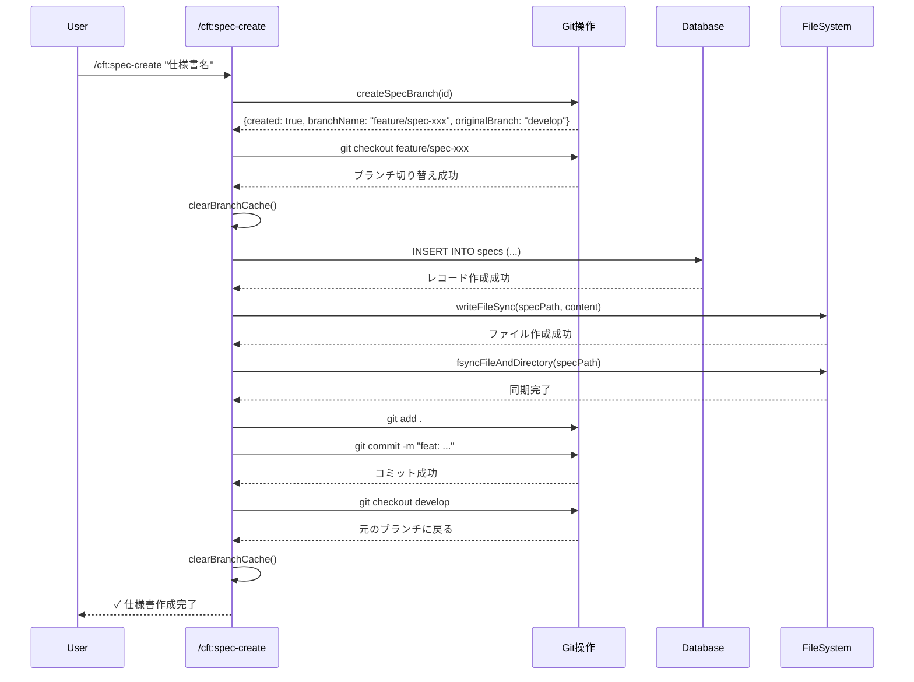

# /cft:spec-create がブランチ作成後すぐに元のブランチに戻り、間違ったブランチでコミットされる

**仕様書 ID:** 9eb739e6-e591-4fc1-ad46-481096de98ba
**フェーズ:** completed
**作成日時:** 2025/11/22 20:13:26
**更新日時:** 2025/11/22 21:12:14

---

## 1. 背景と目的

### 背景

現在、`/cft:spec-create` コマンドは以下の順序で動作しています。

1. 新しいブランチを作成（例: `feature/spec-9eb739e6-fix-spec-create-branch-commit`）
2. **すぐに元のブランチ（develop 等）に戻る**
3. **元のブランチで**データベースレコードとファイルを作成
4. **元のブランチで**Git コミットを実行（問題）

この動作により、仕様書の初回コミットが誤って develop ブランチへ記録され、以下の問題が発生します。

- develop ブランチで push が必要な状態になる（保護ブランチへの直接コミット）
- 作成された feature ブランチにはコミットが存在しない
- 手動で cherry-pick とリセットを行う必要がある

### 目的

`/cft:spec-create` コマンドの実行順序を修正し、以下の正しいフローを実現します。

1. 新しいブランチを作成
2. **新しいブランチに切り替える**
3. **新しいブランチで**データベースレコードとファイルを作成
4. **新しいブランチで**Git コミットを実行
5. 元のブランチに戻る

---

## 2. 対象ユーザー

- cc-craft-kit を使用するすべての開発者
- `/cft:spec-create` コマンドを使用して仕様書を作成する開発者

---

## 3. 受け入れ基準

### 必須要件

- [ ] `/cft:spec-create` 実行時、ブランチ作成後に新しいブランチへ切り替わること
- [ ] 仕様書ファイル作成とコミットが新しいブランチで実行されること
- [ ] コミット完了後、元のブランチに戻ること
- [ ] 元のブランチ（develop 等）に仕様書作成のコミットが残らないこと

### 機能要件

- [ ] ブランチ切り替え処理を `createSpecBranch()` 関数の後に実行すること
- [ ] ブランチ切り替え失敗時、エラーを返して仕様書作成を中断すること
- [ ] コミット完了後、`git checkout <original-branch>` で元のブランチに戻ること
- [ ] 元のブランチに戻る際も、エラーハンドリングを実装すること

### 非機能要件

- [ ] ブランチ切り替え処理は 3 秒以内に完了すること
- [ ] エラー発生時、ロールバック処理が正常に動作すること（ブランチ削除、DB レコード削除、ファイル削除）
- [ ] すべての Git 操作は try-catch でエラーハンドリングすること

### テスト要件

- [ ] 仕様書作成後、feature ブランチにコミットが存在することを E2E テストで検証すること
- [ ] 仕様書作成後、develop ブランチに未コミット変更や未 push コミットが存在しないことを E2E テストで検証すること
- [ ] ブランチ切り替え失敗時、ロールバックが正常に動作することを単体テストで検証すること
- [ ] Git 操作のモック化により、実際のブランチ切り替えを伴わないテストを実装すること

---

## 4. 制約条件

### 技術的制約

- v0.3.0 の仕様「ブランチ作成後の動作」を維持すること（最終的に元のブランチに戻る）
- ブランチ切り替え時にコンフリクトが発生する場合、エラーを返し、手動解決を促すこと
- Git リポジトリが未初期化の場合、エラーを返すこと

### ビジネス的制約

- 保護ブランチ（main, develop）への直接コミットを防ぐこと
- エラー発生時、ユーザーに分かりやすいメッセージを表示すること

---

## 5. 依存関係

### 依存する既存機能

- `src/core/git/branch-creation.ts` - `createSpecBranch()` 関数
- `src/core/git/branch-cache.ts` - ブランチキャッシュ機構（`clearBranchCache()`）
- `src/commands/spec/create.ts` - 仕様書作成コマンド実装

### 影響を受ける機能

- `/cft:spec-create` コマンド実装（`src/commands/spec/create.ts`）
- E2E テスト（`tests/e2e/test-branch-stability.test.ts` 等）

### 関連する仕様書

- `f12b0d21-7e2f-488b-9da0-201935b6f1ff` - `/cft:spec-phase` でのブランチ自動切り替え機能（この仕様書で発見されたバグ）

---

## 6. 参考情報

- CLAUDE.md「ブランチ管理」セクション
- `src/core/git/branch-creation.ts` - ブランチ作成ロジック
- `tests/e2e/test-branch-stability.test.ts` - ブランチ切り替えテストの実装例
- GitHub Issue #287

---

## 7. 設計

### 7.1 アーキテクチャ設計

#### 現在の実装フロー（問題あり）

```typescript
// src/commands/spec/create.ts
async function specCreate(name: string, description?: string) {
  // 1. ブランチ作成
  const branchResult = createSpecBranch(id);

  // 2. すぐに元のブランチに戻る（問題の原因）
  if (branchResult.created && branchResult.originalBranch) {
    execSync(`git checkout ${branchResult.originalBranch}`);
  }

  // 3. 元のブランチでデータベース・ファイル作成
  await db.insertInto('specs').values({...}).execute();
  writeFileSync(specPath, content);

  // 4. 元のブランチでコミット実行（問題）
  execSync('git add .');
  execSync('git commit -m "..."');
}
```

#### 修正後の実装フロー

```typescript
// src/commands/spec/create.ts
async function specCreate(name: string, description?: string) {
  let branchCreated = false;
  let branchName: string | null = null;
  let originalBranch: string | null = null;

  try {
    // 1. ブランチ作成
    const branchResult = createSpecBranch(id);
    if (branchResult.created && branchResult.branchName) {
      branchCreated = true;
      branchName = branchResult.branchName;
      originalBranch = branchResult.originalBranch;

      // 2. 新しいブランチに切り替え（修正箇所）
      execSync(`git checkout ${branchName}`, { stdio: 'pipe' });
      clearBranchCache();
    }

    // 3. 新しいブランチでデータベース・ファイル作成
    await db.insertInto('specs').values({...}).execute();
    writeFileSync(specPath, content);
    fsyncFileAndDirectory(specPath);

    // 4. 新しいブランチでコミット実行
    execSync('git add .');
    execSync(`git commit -m "feat: ${name} の要件定義を完了"`);

    // 5. 元のブランチに戻る
    if (originalBranch) {
      execSync(`git checkout ${originalBranch}`, { stdio: 'pipe' });
      clearBranchCache();
    }

  } catch (error) {
    // ロールバック処理
    if (branchCreated && originalBranch && branchName) {
      execSync(`git checkout ${originalBranch}`, { stdio: 'ignore' });
      execSync(`git branch -D ${branchName}`, { stdio: 'ignore' });
    }
    // ... 既存のロールバック処理
    throw error;
  }
}
```

### 7.2 データフロー設計



### 7.3 エラーハンドリング設計

#### エラーシナリオと対処方法

| エラーシナリオ | 発生タイミング | 対処方法 | ロールバック内容 |
|---|---|---|---|
| ブランチ切り替え失敗 | `git checkout <new-branch>` | エラーを throw し、ロールバック実行 | ブランチ削除、元のブランチに戻る |
| データベース挿入失敗 | `db.insertInto(...)` | エラーを throw し、ロールバック実行 | ブランチ削除、元のブランチに戻る |
| ファイル書き込み失敗 | `writeFileSync(...)` | エラーを throw し、ロールバック実行 | DB レコード削除、ブランチ削除、元のブランチに戻る |
| Git コミット失敗 | `git commit` | エラーを throw し、ロールバック実行 | ファイル削除、DB レコード削除、ブランチ削除、元のブランチに戻る |
| 元のブランチへの切り替え失敗 | `git checkout <original-branch>` | 警告を表示し、手動対応を促す | ロールバック不要（仕様書は正常に作成済み） |

#### エラーメッセージ設計

```typescript
// ブランチ切り替え失敗時
`Failed to checkout to new branch: ${branchName}. Error: ${error.message}`

// 元のブランチへの切り替え失敗時
`Warning: Failed to return to original branch: ${originalBranch}. Please run 'git checkout ${originalBranch}' manually.`

// ロールバック失敗時
`Failed to rollback branch: ${branchName}. Please run 'git branch -D ${branchName}' manually.`
```

### 7.4 API 設計

#### 既存関数の変更は不要

`createSpecBranch()` 関数は変更せず、呼び出し側の `src/commands/spec/create.ts` のみ修正します。

```typescript
// src/core/git/branch-creation.ts（変更なし）
export interface BranchCreationResult {
  created: boolean;
  branchName: string | null;
  originalBranch: string | null;
  reason?: string;
}

export function createSpecBranch(
  specId: string,
  customBranchName?: string
): BranchCreationResult;
```

#### 新規関数の追加（オプション）

ブランチ切り替え処理を共通化する場合、以下のヘルパー関数を追加することも検討できます。

```typescript
// src/core/git/branch-switching.ts（新規ファイル）

/**
 * ブランチに安全に切り替える
 * @param branchName 切り替え先のブランチ名
 * @throws Error ブランチ切り替えに失敗した場合
 */
export function switchBranch(branchName: string): void {
  try {
    execSync(`git checkout ${branchName}`, { stdio: 'pipe' });
    clearBranchCache();
  } catch (error) {
    throw new Error(`Failed to switch to branch: ${branchName}. Error: ${error.message}`);
  }
}
```

### 7.5 データモデル設計

データベーススキーマの変更は不要です。既存の `specs` テーブルをそのまま使用します。

### 7.6 セキュリティ設計

#### コマンドインジェクション対策

ブランチ名は `createSpecBranch()` 関数内で既にサニタイゼーション済みのため、追加の対策は不要です。

```typescript
// src/core/git/branch-creation.ts（既存のセキュリティ対策）
const sanitizedId = specId.replace(/[^0-9a-f-]/g, '');
const branchName = customBranchName
  ? `${prefix}${shortId}-${customBranchName.replace(/[^a-zA-Z0-9-_]/g, '')}`
  : `${prefix}${shortId}`;
```

#### 情報漏洩対策

エラーメッセージには Git のエラー詳細を含めず、ユーザーフレンドリーなメッセージのみを表示します。

```typescript
// 悪い例（Git エラー詳細が漏洩）
console.error(error.stack);

// 良い例（安全なメッセージ）
console.error(`Failed to checkout to new branch: ${branchName}`);
```

### 7.7 パフォーマンス設計

#### Git 操作の最適化

- ブランチ切り替えは `stdio: 'pipe'` を使用して出力を抑制
- `clearBranchCache()` を適切なタイミングで呼び出し、不要な Git コマンド実行を防止

#### 目標パフォーマンス

| 操作 | 目標時間 |
|---|---|
| ブランチ切り替え | < 1 秒 |
| 仕様書作成全体 | < 3 秒 |

### 7.8 テスト設計

#### 単体テスト

```typescript
// tests/commands/spec/create-branch-flow.test.ts（新規ファイル）

describe('spec-create branch flow', () => {
  it('should create spec on new branch, commit, and return to original branch', () => {
    // モック設定
    const mockExecSync = vi.mocked(execSync);

    // 実行
    // ... spec-create 実行

    // 検証
    expect(mockExecSync).toHaveBeenCalledWith('git checkout feature/spec-xxx', { stdio: 'pipe' });
    expect(mockExecSync).toHaveBeenCalledWith('git commit -m "..."');
    expect(mockExecSync).toHaveBeenCalledWith('git checkout develop', { stdio: 'pipe' });
  });

  it('should rollback on branch checkout failure', () => {
    // モック設定（ブランチ切り替え失敗）
    const mockExecSync = vi.mocked(execSync);
    mockExecSync.mockImplementation((cmd) => {
      if (cmd.includes('git checkout feature/spec-')) {
        throw new Error('Checkout failed');
      }
      return Buffer.from('');
    });

    // 実行と検証
    expect(() => {
      // ... spec-create 実行
    }).toThrow();

    // ロールバック確認
    expect(mockExecSync).toHaveBeenCalledWith('git branch -D feature/spec-xxx', { stdio: 'ignore' });
  });
});
```

#### E2E テスト

```typescript
// tests/e2e/spec-create-branch-commit.test.ts（新規ファイル）

describe('spec-create branch commit E2E', () => {
  it('should commit on new branch, not on original branch', async () => {
    const originalBranch = execSync('git branch --show-current', { encoding: 'utf-8' }).trim();

    // 仕様書作成
    // ... spec-create 実行

    // feature ブランチにコミットが存在することを確認
    execSync(`git checkout ${newBranchName}`);
    const commitLog = execSync('git log -1 --oneline', { encoding: 'utf-8' });
    expect(commitLog).toContain('feat: 新機能 の要件定義を完了');

    // 元のブランチにコミットが存在しないことを確認
    execSync(`git checkout ${originalBranch}`);
    const status = execSync('git status --short', { encoding: 'utf-8' });
    expect(status).toBe(''); // 未コミット変更なし

    const unpushedCommits = execSync('git log @{u}.. --oneline', { encoding: 'utf-8' });
    expect(unpushedCommits).toBe(''); // 未 push コミットなし
  });
});
```

---

## 8. 実装タスクリスト

- [ ] ブランチ切り替え処理を createSpecBranch() の後に実装する
- [ ] 新しいブランチでデータベース・ファイル作成を実行するよう修正する
- [ ] コミット完了後、元のブランチに戻る処理を実装する
- [ ] ブランチ切り替え失敗時のエラーハンドリングを実装する
- [ ] ロールバック処理にブランチ削除と元のブランチへの復帰を追加する
- [ ] 単体テストを実装する(ブランチ切り替えフロー、ロールバック)
- [ ] E2E テストを実装する (feature ブランチにコミット、develop ブランチに未コミット変更なし)

---

## 9. 備考

- v0.3.0 の仕様を維持しつつ、コミット先ブランチのみを修正
- 既存の `createSpecBranch()` 関数は変更不要
- エラーハンドリングとロールバック処理を強化
