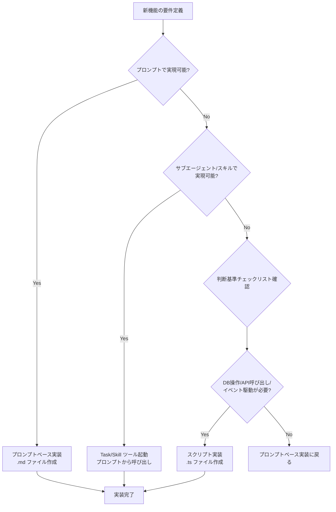

# 開発キット開発時の設計および実装のルール CLAUDE.md に適切に追記

**仕様書 ID:** a6e1c24a-9039-451f-a9bc-3c60cba8651f
**フェーズ:** completed
**作成日時:** 2025/11/24 08:30:51
**更新日時:** 2025/11/24 08:56:18

---

## 1. 背景と目的

### 背景

開発キットの開発においては、以下のルールを徹底したい。CLUADE.md に効果的な表現で追記したい。
設計・実装においては、以下の点に十分気を付けて欲しい。
- プロンプトファースト：プロンプトで実現できることはプロンプトで実現すること
- スキルで実現できないか、サブエージェントで実現できないかよく考えること
- スクリプトによる実現は、最終手段です

### 目的

CLAUDE.md に開発キット開発時の設計・実装指針を追記し、以下を明確化する：

1. **プロンプトファースト原則の徹底**: プロンプト (.md) で実現可能な機能は、スクリプト (.ts) ではなくプロンプトで実装する
2. **スキル・サブエージェント活用の推奨**: Task ツール、Skill ツールを活用し、複雑な処理をサブエージェントに委譲する
3. **スクリプト実装の最小化**: TypeScript スクリプトは、データベース操作、GitHub API、イベント駆動処理など、プロンプトで実現不可能な処理に限定する

これにより、開発者が適切な実装方法を選択できるようにし、保守性・拡張性の高いコードベースを維持する。

---

## 2. 対象ユーザー

**対象**: cc-craft-kit の開発者（コントリビューター、メンテナー）

**役割**:
- 新機能の設計・実装
- 既存機能のリファクタリング
- バグ修正
- ドキュメント整備

**前提知識**:
- TypeScript の基礎知識
- Claude Code の仕組み（プロンプト、スキル、サブエージェント）
- cc-craft-kit のアーキテクチャ（モジュラーモノリス、イベント駆動）

---

## 3. 受け入れ基準

### 必須要件

- [ ] CLAUDE.md に「設計・実装の判断基準」セクションを追加
- [ ] プロンプトファースト原則を明確に記述
- [ ] スキル・サブエージェント活用の推奨を明記
- [ ] スクリプト実装が必要な処理の具体例を列挙
- [ ] プロンプトベース実装の具体例を列挙

### 機能要件

- [ ] 既存セクション「スクリプトとプロンプトの使い分け指針」を拡張
- [ ] 判断基準チェックリストを強化（プロンプトファースト視点を追加）
- [ ] 実装パターンの参照ファイルを明記（例: `src/slash-commands/code-review.md`）
- [ ] 設計フロー図を追加（プロンプト → スキル → スクリプトの順）

### 非機能要件

- [ ] 既存 CLAUDE.md の記述スタイルと統一
- [ ] 開発者が迷わずに実装方法を選択できる明確さ
- [ ] 実装例は実際のコードベースから抽出（架空の例は使用しない）
- [ ] 参考ファイルへのパスは絶対パスで記載

---

## 8. 実装タスクリスト

### 完了したタスク

- [x] CLAUDE.md の現在の構造を確認
- [x] 既存セクション「スクリプトとプロンプトの使い分け指針」を拡張（実装パターンマトリクスの追加）
- [x] 既存セクション「スクリプトとプロンプトの使い分け指針」を拡張（自動実行フローの設計指針の追加）
- [x] 新規セクション「開発キット開発時の設計・実装ガイドライン」を追加（プロンプトファースト実装フロー）
- [x] 新規セクション「開発キット開発時の設計・実装ガイドライン」を追加（サブエージェント・スキル活用パターン）
- [x] 新規セクション「開発キット開発時の設計・実装ガイドライン」を追加（実装前のチェックポイント）
- [x] 新規セクション「開発キット開発時の設計・実装ガイドライン」を追加（よくある実装パターン）
- [x] 型チェックと ESLint を実行して品質確認
- [x] 同期して動作確認（npm run sync:dogfood）

### 実装サマリー

CLAUDE.md に以下の内容を追加しました:

**既存セクション「スクリプトとプロンプトの使い分け指針」の拡張**:
- 実装パターンマトリクス（処理内容ごとにプロンプト/スキル/スクリプトの使い分けを明示）
- 自動実行フローの設計指針（4つの設計ポイント: 明示的な指示、実行順序、エラー時の分岐、実装例の参照）

**新規セクション「開発キット開発時の設計・実装ガイドライン」**:
- プロンプトファースト実装フロー（5ステップ: 要件整理、実装方法選択、設計・実装、品質チェック、ドキュメント更新）
- サブエージェント・スキル活用パターン（3つのパターン: ファイルパターン解決+サブエージェント起動、事前情報収集+質問+自動補完、スキル起動+エラー修正）
- 実装前のチェックポイント（4段階: 設計、実装、テスト、ドキュメント）
- よくある実装パターン（3つのテンプレート: データベース操作、サブエージェント起動、バリデーション+自動補完）

これにより、開発者が適切な実装方法を迷わずに選択できるようになりました。

---

## 4. 制約条件

### 技術的制約

- **既存セクション構造の維持**: CLAUDE.md の既存セクション順序を保持する
- **Markdown 形式**: 見出しレベル、リスト形式、コードブロックを既存スタイルに合わせる
- **ファイルパス表記**: プロジェクトルートからの相対パス（例: `src/commands/spec/create.ts`）

### 設計制約

- **既存セクション「スクリプトとプロンプトの使い分け指針」との整合性**: 重複を避け、補完する内容にする
- **プロンプトファースト原則**: Claude Code の基本思想に従う
- **実装例の正確性**: 実際のコードベースに存在するファイル・関数名のみを記載

### 運用上の制約

- **開発者の学習コスト**: 新規開発者が 30 分以内に理解できる記述量
- **保守性**: CLAUDE.md の更新頻度を考慮し、アーキテクチャ変更に強い記述にする

---

## 5. 依存関係

### 既存仕様書

- なし（CLAUDE.md の更新のみのため、他の仕様書への依存なし）

### 既存コンポーネント

**参照するファイル**:
- `CLAUDE.md` - 更新対象ファイル
- `src/slash-commands/**/*.md` - プロンプトベース実装の例
- `src/commands/**/*.ts` - スクリプト実装の例
- `src/core/workflow/event-bus.ts` - イベント駆動実装の例

**参照する実装パターン**:
- プロンプトベース: `src/slash-commands/code-review.md`, `test-generate.md`, `refactor.md`
- スクリプト実装: `src/commands/spec/create.ts`, `github/issue-create.ts`

---

## 6. 参考情報

### 公式ドキュメント

- [ARCHITECTURE.md](./docs/ARCHITECTURE.md) - アーキテクチャ設計の詳細
- [QUICK_START.md](./docs/QUICK_START.md) - 開発環境セットアップ

### 既存の実装例

**プロンプトベース実装:**
- `src/slash-commands/spec-phase.md` - フェーズ遷移（バリデーション、自動処理）
- `src/slash-commands/code-review.md` - code-reviewer サブエージェント起動
- `src/slash-commands/test-generate.md` - test-generator サブエージェント起動
- `src/slash-commands/refactor.md` - refactoring-assistant サブエージェント起動

**スクリプト実装:**
- `src/commands/spec/create.ts` - 仕様書作成（DB操作、イベント発火）
- `src/commands/spec/phase.ts` - フェーズ更新（DB操作、Git統合）
- `src/commands/github/issue-create.ts` - GitHub Issue 作成（Octokit 認証、API呼び出し）
- `src/commands/sync/check.ts` - 整合性チェック（複雑なバリデーション）

### 技術スタック

- **プロンプトベース**: Markdown, Claude Code ツール（Task, Skill, Read, Write, Edit, Glob, Grep, Bash）
- **スクリプト**: TypeScript, Kysely, EventEmitter2, Octokit, Zod

---

## 7. 設計詳細

### 7.1. アーキテクチャ設計

#### 7.1.1. 更新対象ファイル

**CLAUDE.md の既存セクション構造**:

```
## プロジェクト概要
## 開発フロー
## コーディング規約
## テスト戦略
## 開発時の注意事項
## トラブルシューティング
## スクリプトとプロンプトの使い分け指針  ← 拡張対象セクション
## 参考ドキュメント
```

**更新方針**:

1. **既存セクション「スクリプトとプロンプトの使い分け指針」を拡張**
   - 現在の内容: プロンプトファースト原則、スクリプト実装が必要な処理、判断基準チェックリスト
   - 追加する内容: 設計フローガイド、実装パターンマトリクス、自動実行フローの設計指針

2. **新規セクション「開発キット開発時の設計・実装ガイドライン」を追加**（「スクリプトとプロンプトの使い分け指針」の直後）
   - 3層アーキテクチャの意識
   - プロンプトファースト実装フロー
   - サブエージェント・スキル活用パターン
   - 実装前のチェックポイント

#### 7.1.2. 3層アーキテクチャの強調

cc-craft-kit は以下の3層構造で設計されています:

```
┌─────────────────────────────────────────────────┐
│  プロンプト層 (.md)                              │
│  - スラッシュコマンド定義                        │
│  - 自動実行フロー記述                           │
│  - ユーザー向けガイダンス                        │
│  - Task/Skill ツール起動                         │
└─────────────────────────────────────────────────┘
                      ↓
┌─────────────────────────────────────────────────┐
│  スクリプト層 (.ts)                              │
│  - CLI コマンド実装                             │
│  - データベース操作                              │
│  - GitHub API 呼び出し                          │
│  - イベント発火・ハンドラー登録                  │
└─────────────────────────────────────────────────┘
                      ↓
┌─────────────────────────────────────────────────┐
│  コア層 (src/core/**)                            │
│  - データベース接続管理                          │
│  - イベントバス                                  │
│  - バリデーター                                  │
│  - エラークラス                                  │
└─────────────────────────────────────────────────┘
```

**設計原則**:

1. **上位層から下位層への依存のみ許可** - 下位層は上位層に依存しない
2. **プロンプト層は最大限活用** - スクリプト実装前にプロンプトで実現可能か検討
3. **コア層は再利用可能な共通機能** - 特定のコマンドに依存しない設計

#### 7.1.3. 設計フロー図

新機能を実装する際の判断フロー:



### 7.2. データモデル

この仕様書はドキュメント更新のみのため、データベーススキーマの変更は不要です。

**参照する既存データモデル**:

- 仕様書テーブル (`specs`): フェーズ管理、プロジェクトステータス
- GitHub 統合テーブル (`github_config`, `github_issues`): Issue 連携情報

### 7.3. CLAUDE.md への追加内容

#### 7.3.1. 既存セクション「スクリプトとプロンプトの使い分け指針」への追加

**追加箇所**: 判断基準チェックリストの直後

**追加内容**:

```markdown
### 実装パターンマトリクス

以下のマトリクスで、実装パターンを素早く選択できます。

| 処理内容 | プロンプト | スキル | スクリプト | 実装例 |
|---|:---:|:---:|:---:|---|
| **ファイル読み書き** | ✅ | - | - | `Read`, `Write`, `Edit` ツール |
| **コードレビュー** | ✅ | ✅ | - | `code-review.md` → `code-reviewer` サブエージェント |
| **テスト生成** | ✅ | ✅ | - | `test-generate.md` → `test-generator` サブエージェント |
| **リファクタリング** | ✅ | ✅ | - | `refactor.md` → `refactoring-assistant` サブエージェント |
| **データベース操作** | - | - | ✅ | `spec/create.ts`, `spec/phase.ts` |
| **GitHub API 呼び出し** | - | - | ✅ | `github/issue-create.ts` |
| **イベント駆動処理** | - | - | ✅ | `spec/create.ts` (spec.created イベント) |
| **ファイル監視** | - | - | ✅ | `watch.ts` |
| **複雑なバリデーション** | - | - | ✅ | `phase-transition-validator.ts` |
| **Bash コマンド実行** | ✅ | - | - | `npm run lint`, `git status` |
| **ガイダンス表示** | ✅ | - | - | メッセージ表示、使用例提示 |

**実装パターンの選択ルール**:

1. **プロンプト** → **スキル** → **スクリプト** の順で検討
2. プロンプトで実現できる場合は、必ずプロンプトを選択
3. サブエージェント・スキルで実現できる場合は、Task/Skill ツールで起動
4. スクリプト実装は、判断基準チェックリストで1つ以上該当する場合のみ

### 自動実行フローの設計指針

スラッシュコマンド (.md) で自動実行フローを設計する際の指針:

#### 1. 明示的な自動実行指示

```markdown
重要: コマンド実行後、ユーザーに確認を求めずに、以下の処理を**自動的に実行**してください。
```

#### 2. ツールの実行順序を定義

```markdown
1. **ファイルパターンの解決**: Glob ツールで対象ファイルを検索
2. **コードベース解析**: Task ツールで Explore サブエージェント実行 (thoroughness: "medium")
3. **自動補完**: Edit ツールで不足セクションを追記
4. **ユーザー確認**: AskUserQuestion で推論困難な情報を質問（最大4つまで）
5. **再実行**: コマンド再実行
```

#### 3. エラー時の分岐処理

```markdown
### バリデーションエラーが出た場合

1. エラーメッセージから不足セクションを特定
2. 既存仕様書から類似パターンを検索
3. 推論可能な情報は自動補完、推論困難な情報は質問
4. 補完完了後、コマンド再実行
```

#### 4. 実装例の参照

以下の実装パターンを参考にしてください:

- **フェーズ遷移時の自動処理**: `src/slash-commands/spec-phase.md` (141-188行)
- **仕様書作成時の自動完成**: `src/slash-commands/spec-create.md` (103-265行)
- **コード品質レビュー**: `src/slash-commands/code-review.md` (40-63行)
- **リント・型チェック**: `src/slash-commands/lint-check.md` (32-62行)
```

#### 7.3.2. 新規セクション「開発キット開発時の設計・実装ガイドライン」

**追加箇所**: 「スクリプトとプロンプトの使い分け指針」セクションの直後

**追加内容**:

```markdown
## 開発キット開発時の設計・実装ガイドライン

### プロンプトファースト実装フロー

開発キットの新機能を実装する際は、以下のフローに従ってください。

#### ステップ 1: 要件の整理

- [ ] 何を実現したいか明確にする
- [ ] 対象ユーザー・使用シーンを定義する
- [ ] 既存の類似機能を調査する

#### ステップ 2: 実装方法の選択

**優先順位**: プロンプト → スキル → スクリプト

1. **プロンプトで実現可能か?**
   - Read/Write/Edit ツールで完結するか?
   - Bash コマンド実行のみで済むか?
   - ガイダンス表示が主目的か?

2. **サブエージェント・スキルで実現可能か?**
   - コードレビュー → `code-reviewer` サブエージェント
   - テスト生成 → `test-generator` サブエージェント
   - リファクタリング → `refactoring-assistant` サブエージェント
   - スキーマ検証 → `database-schema-validator` スキル
   - リント・型チェック → `typescript-eslint` スキル

3. **スクリプト実装が必要か?**
   - 判断基準チェックリスト（「スクリプトとプロンプトの使い分け指針」参照）で確認
   - 1つでも該当すれば、スクリプト実装を選択

#### ステップ 3: 設計・実装

**プロンプトベース実装の場合**:

1. `src/slash-commands/` に `.md` ファイルを作成
2. 自動実行フローを明示的に記述
3. ツールの実行順序を定義
4. エラー時の分岐処理を含める
5. `npm run sync:dogfood` で同期

**スクリプト実装の場合**:

1. `src/commands/` または `src/integrations/` に `.ts` ファイルを作成
2. Zod スキーマで引数バリデーション
3. エラーハンドリング（`src/core/errors/` の標準エラークラス使用）
4. イベント発火（必要に応じて `src/core/workflow/event-bus.ts` 使用）
5. `npx tsc --noEmit` で型チェック
6. `npm run sync:dogfood` で同期

#### ステップ 4: 品質チェック

- [ ] 型エラーがないか確認（`npx tsc --noEmit`）
- [ ] リント・フォーマット（`npm run lint:fix`）
- [ ] 単体テスト作成（`tests/` に `*.test.ts`）
- [ ] カバレッジ確認（`npm run test:coverage`）

#### ステップ 5: ドキュメント更新

- [ ] CLAUDE.md に実装パターンを追記（必要に応じて）
- [ ] README.md にコマンド説明を追記（ユーザー向け機能の場合）
- [ ] 仕様書を completed フェーズに移行

### サブエージェント・スキル活用パターン

プロンプトから Task/Skill ツールを起動する際のパターン:

#### パターン 1: ファイルパターン解決 + サブエージェント起動

```markdown
1. **ファイルパターンの解決**: Glob ツールで `$1` パターンのファイルを検索
2. **サブエージェント起動**: Task ツールで `code-reviewer` サブエージェントを実行
   - 対象ファイル: Glob の検索結果
   - thoroughness: "medium"
3. **結果の報告**: 構造化された形式で表示
```

**実装例**: `src/slash-commands/code-review.md`

#### パターン 2: 事前情報収集 + 質問 + 自動補完

```markdown
1. **事前情報収集**: Task ツールで Explore サブエージェント実行 (thoroughness: "medium")
2. **既存パターン検索**: Glob ツールで類似ファイルを検索
3. **不明情報の確認**: AskUserQuestion で質問（最大4つまで）
4. **自動補完**: Edit ツールで不足セクションを追記
```

**実装例**: `src/slash-commands/spec-create.md`

#### パターン 3: スキル起動 + エラー修正

```markdown
1. **スキル起動**: Skill ツールで `typescript-eslint` スキルを実行
2. **エラー確認**: 型エラー・ESLint 警告の有無を確認
3. **自動修正**: Edit ツールで修正可能なエラーを修正
4. **再実行**: `npm run lint:fix` または `npx tsc --noEmit` で確認
```

**実装例**: `src/slash-commands/lint-check.md`

### 実装前のチェックポイント

新機能を実装する前に、以下のチェックポイントを確認してください:

#### 設計段階

- [ ] プロンプトファースト原則に従っているか?
- [ ] 3層アーキテクチャの役割分離を意識しているか?
- [ ] 既存の類似機能を調査したか?
- [ ] 実装パターンマトリクスで実装方法を選択したか?

#### 実装段階

- [ ] TypeScript の型安全性を活用しているか?（スクリプトの場合）
- [ ] 自動実行フローを明示的に記述したか?（プロンプトの場合）
- [ ] エラーハンドリングを適切に実装したか?
- [ ] セキュリティ考慮事項を確認したか?

#### テスト段階

- [ ] 単体テストを作成したか?
- [ ] カバレッジ目標（80%以上）を達成したか?
- [ ] モック化を適切に実施したか?（DB、GitHub API、Git操作）

#### ドキュメント段階

- [ ] CLAUDE.md に実装パターンを追記したか?（必要に応じて）
- [ ] コミットメッセージは Conventional Commits に従っているか?
- [ ] PR 作成時に仕様書 ID を含めたか?

### よくある実装パターン

#### パターン 1: データベース操作を伴うコマンド

**実装方法**: TypeScript スクリプト

**テンプレート**:

```typescript
// src/commands/example/create.ts
import { getDatabase } from '../../core/database/connection.js';
import { eventBus } from '../../core/workflow/event-bus.js';
import { z } from 'zod';

const argsSchema = z.object({
  name: z.string().min(1),
});

export async function createExample(args: string[]): Promise<void> {
  const parsed = argsSchema.parse({ name: args[0] });

  const db = getDatabase();

  // トランザクション開始
  await db.transaction().execute(async (trx) => {
    // DB操作
    const result = await trx.insertInto('examples')
      .values({ name: parsed.name })
      .returning('id')
      .executeTakeFirstOrThrow();

    // イベント発火
    eventBus.emit('example.created', { id: result.id, name: parsed.name });
  });
}
```

#### パターン 2: サブエージェント起動コマンド

**実装方法**: プロンプトベース (.md)

**テンプレート**:

```markdown
# コマンド名

## 自動実行フロー

重要: コマンド実行後、ユーザーに確認を求めずに、以下の処理を**自動的に実行**してください。

1. **ファイルパターンの解決**: Glob ツールで `$1` パターンのファイルを検索
2. **サブエージェント起動**: Task ツールで `サブエージェント名` サブエージェントを実行
   - 対象ファイル: Glob の検索結果
   - thoroughness: "medium"
3. **結果の報告**: 構造化された形式で表示
```

#### パターン 3: バリデーション + 自動補完コマンド

**実装方法**: プロンプトベース (.md) + スクリプト (.ts)

**プロンプト側**:

```markdown
## バリデーションエラーが出た場合

1. **仕様書ファイルを読み込む**: Read ツール
2. **不足セクションを確認**: エラーメッセージ解析
3. **コードベース解析**: Task ツール（Explore サブエージェント）
4. **自動補完**: Edit ツール + AskUserQuestion
5. **再実行**: コマンド再実行
```

**スクリプト側**:

```typescript
// src/core/validators/example-validator.ts
export function validateExample(content: string): ValidationResult {
  const placeholders = detectPlaceholders(content);
  const missingSections = detectMissingSections(content, REQUIRED_SECTIONS);

  return {
    isValid: placeholders.length === 0 && missingSections.length === 0,
    needsCompletion: placeholders.length > 0 || missingSections.length > 0,
    placeholders: placeholders.length > 0 ? { count: placeholders.length } : undefined,
    missingSections,
  };
}
```
```

### 7.4. セキュリティ考慮事項

#### 7.4.1. ドキュメント更新時のセキュリティリスク

この仕様書はドキュメント更新のみのため、セキュリティリスクは限定的です。

**考慮すべき点**:

1. **記載する実装例の安全性**
   - SQL インジェクションの脆弱なコード例を記載しない
   - XSS の脆弱なコード例を記載しない
   - センシティブ情報（トークン、パスワード）を含むコード例を記載しない

2. **ファイルパスの正確性**
   - 実際に存在するファイルパスのみを記載
   - 架空の例は使用しない
   - プロジェクトルートからの相対パスで記載

3. **既存のセキュリティガイドラインとの整合性**
   - 「## コーディング規約 > ### セキュリティ」セクションと矛盾しない内容にする
   - Zod スキーマ検証、Kysely パラメータ化クエリ、HTML サニタイゼーションの原則を維持

#### 7.4.2. 開発者への注意喚起

CLAUDE.md に追加する内容には、以下のセキュリティ注意事項を含める:

```markdown
### セキュリティ注意事項

- **スクリプト実装時**:
  - CLI 引数は必ず Zod スキーマで検証
  - データベース操作は Kysely のパラメータ化クエリのみ使用
  - エラーメッセージにセンシティブ情報を含めない

- **プロンプト実装時**:
  - Bash コマンド実行時は、ユーザー入力をそのまま渡さない
  - ファイルパスは検証してから Read/Write/Edit ツールで使用

- **GitHub API 連携時**:
  - トークンは環境変数（`.env`）で管理
  - レート制限を考慮した実装
  - エラーログにトークンを出力しない
```

### 7.5. テスト戦略

#### 7.5.1. ドキュメント更新のテスト

**検証項目**:

1. **記載内容の正確性**
   - 実装例のファイルパスが実際に存在するか確認
   - コード例が型エラーなく動作するか確認

2. **既存セクションとの整合性**
   - 「スクリプトとプロンプトの使い分け指針」と矛盾しないか
   - 「コーディング規約」と一貫性があるか

3. **可読性・理解しやすさ**
   - 新規開発者が 30 分以内に理解できるか
   - 判断基準チェックリストが明確か

#### 7.5.2. 実装例の検証テスト

**テスト対象**:

- パターン 1: データベース操作を伴うコマンド（テンプレート）
- パターン 2: サブエージェント起動コマンド（テンプレート）
- パターン 3: バリデーション + 自動補完コマンド（テンプレート）

**テスト方法**:

```bash
# 型チェック
npx tsc --noEmit

# リント
npm run lint

# 実装例のコードが実際に動作するか確認
# (テンプレートコードを実際のファイルに適用してテスト)
```

#### 7.5.3. 受け入れテスト

**検証項目**:

- [ ] CLAUDE.md に「設計・実装の判断基準」セクションを追加
- [ ] プロンプトファースト原則を明確に記述
- [ ] スキル・サブエージェント活用の推奨を明記
- [ ] スクリプト実装が必要な処理の具体例を列挙
- [ ] プロンプトベース実装の具体例を列挙
- [ ] 既存セクション「スクリプトとプロンプトの使い分け指針」を拡張
- [ ] 判断基準チェックリストを強化（プロンプトファースト視点を追加）
- [ ] 実装パターンの参照ファイルを明記
- [ ] 設計フロー図を追加（プロンプト → スキル → スクリプトの順）
- [ ] 既存 CLAUDE.md の記述スタイルと統一
- [ ] 開発者が迷わずに実装方法を選択できる明確さ
- [ ] 実装例は実際のコードベースから抽出
- [ ] 参考ファイルへのパスは相対パスで記載
