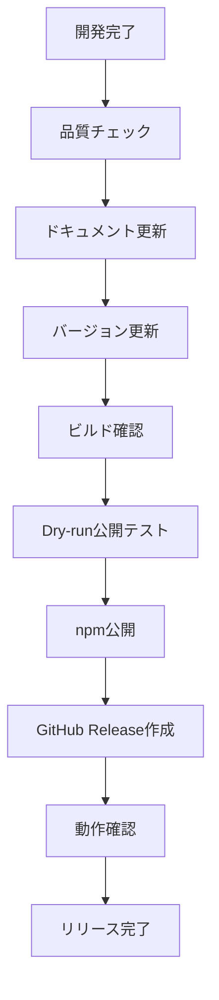
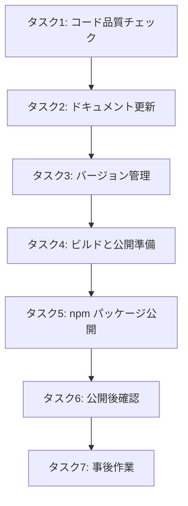

# バージョン 0.1.0 のリリース


## 1. 背景と目的

### 背景

cc-craft-kit は、Claude Code 上で仕様駆動開発（SDD）と GitHub Projects/Issues 完全連携を実現する開発支援ツールキットとして開発されてきました。以下の主要機能が実装完了し、基本的な開発ワークフローが動作する状態になったため、初期バージョン 0.1.0 として公開します。

**実装済み主要機能:**
- プロジェクト管理（初期化、状態確認）
- 仕様書管理（作成、一覧、詳細表示、フェーズ管理）
- GitHub 統合（Issue 作成・同期、Projects 連携）
- Git 自動コミット機能
- コード品質チェック（code-reviewer, test-generator サブエージェント）
- データベーススキーマ検証（database-schema-validator スキル）

**リリース判断理由:**
- 基本的な仕様駆動開発ワークフローが完成
- ドッグフーディング（自分自身を使った開発）で動作検証済み
- 外部ユーザーからのフィードバック収集が可能な状態

### 目的

- cc-craft-kit の初期バージョン（0.1.0）を公開し、外部ユーザーが試用できる状態にする
- npm パッケージとして公開し、簡単にインストール可能にする
- 基本的な仕様駆動開発（SDD）ワークフローと GitHub 統合機能を提供する
---

## 2. 対象ユーザー

### 主要ターゲット

- Claude Code を活用して開発を行っている個人開発者
- 仕様駆動開発（SDD）に興味がある開発者
- GitHub Projects/Issues と連携した開発ワークフローを構築したい開発者

### 想定スキルレベル

- Node.js/TypeScript の基本的な知識を持つ開発者
- Git/GitHub の基本操作ができる開発者
- Claude Code のスラッシュコマンドを使用した経験がある開発者
---

## 3. 受け入れ基準

### 必須要件

- [ ] package.json のバージョンが 0.1.0 に設定されている
- [ ] npm パッケージとして正常に公開できる（公開前にドライランで確認）
- [ ] README.md にインストール手順と基本的な使用方法が記載されている
- [ ] MIT ライセンスファイルが含まれている
- [ ] すべての型チェック（npm run typecheck）がエラーなく完了する
- [ ] すべてのテスト（npm test）が成功する

### 機能要件

- [ ] 基本的なスラッシュコマンドが動作する（/cft:init, /cft:status, /cft:spec-create）
- [ ] 仕様書の CRUD 操作が正常に動作する
- [ ] GitHub Issue 連携（Issue 作成・同期）が動作する
- [ ] フェーズ管理（requirements → design → tasks → implementation → completed）が動作する
- [ ] Git 自動コミット機能が動作する
- [ ] コマンドラインヘルプ（--help）がすべてのコマンドで表示される

### 非機能要件

- [ ] TypeScript strict mode で型エラーが 0 件
- [ ] ESLint 警告が 0 件（重要度: error レベル）
- [ ] テストカバレッジが 70% 以上
- [ ] セキュリティ脆弱性スキャン（npm audit）で重大な問題が 0 件
- [ ] ドキュメントが最新の実装に追従している
- [ ] CHANGELOG.md に 0.1.0 のリリースノートが記載されている
---

## 4. 制約条件

### 技術的制約

- Node.js 18.0.0 以上が必要
- npm 9.0.0 以上が必要
- Claude Code がインストールされている環境でのみ動作
- GitHub Personal Access Token（Fine-grained PAT）が必要（GitHub 連携機能を使用する場合）

### リリース制約

- 公開前に npm パッケージ名 `cc-craft-kit` が利用可能であることを確認する
- セマンティックバージョニング（SemVer）に従う
- 破壊的変更（Breaking Changes）は明示的に CHANGELOG.md に記載する

### スコープ制約

- 0.1.0 では以下の機能は含めない（将来バージョンで対応）:
  - Backlog 統合プラグイン
  - Slack 通知プラグイン
  - Webhook による GitHub → cc-craft-kit の自動同期
---

## 5. 依存関係

### 前提条件

- すべての主要機能の実装が完了していること
- すべての既存の仕様書が completed フェーズに到達していること
- Git 自動コミット機能の実装が完了していること

### 外部依存

- npm レジストリへのアクセス権限
- GitHub リポジトリへの push 権限
- パッケージ公開に必要な npm アカウント

### 内部依存

- `src/` 配下のすべてのソースコードが最新状態で同期されていること
- `.cc-craft-kit/` との整合性が保たれていること（npm run check:sync で確認）
---

## 6. 参考情報

### リリース関連ドキュメント

- [npm パッケージ公開ガイド](https://docs.npmjs.com/packages-and-modules/contributing-packages-to-the-registry)
- [セマンティックバージョニング仕様](https://semver.org/lang/ja/)
- [CHANGELOG.md 記法](https://keepachangelog.com/ja/1.0.0/)

### プロジェクト内ドキュメント

- [ARCHITECTURE.md](/home/autum/Projects/personal/cc-craft-kit/docs/ARCHITECTURE.md) - アーキテクチャ設計
- [QUICK_START.md](/home/autum/Projects/personal/cc-craft-kit/docs/QUICK_START.md) - クイックスタートガイド
- [README.md](/home/autum/Projects/personal/cc-craft-kit/README.md) - プロジェクト概要

### 関連 Issue

- GitHub Issue #47: https://github.com/B16B1RD/cc-craft-kit/issues/47
---

## 7. リリース設計

### リリースフロー



### リリースチェックリスト

#### 1. コード品質チェック

- [ ] `npm run typecheck` でエラー 0 件
- [ ] `npm run lint` でエラー 0 件（警告は許容）
- [ ] `npm test` で全テスト成功
- [ ] `npm audit` で重大な脆弱性 0 件
- [ ] `npm run check:sync` で src と .cc-craft-kit の整合性確認

#### 2. ドキュメント更新

- [ ] README.md の以下セクションが最新:
  - インストール手順
  - クイックスタート
  - スラッシュコマンド一覧
  - 必要な環境変数
- [ ] CHANGELOG.md に 0.1.0 の変更内容を記載:
  - 新機能（Added）
  - 変更（Changed）
  - 非推奨（Deprecated）
  - 削除（Removed）
  - 修正（Fixed）
  - セキュリティ（Security）
- [ ] package.json のメタデータが正確:
  - description
  - keywords
  - repository
  - bugs
  - homepage
  - author
  - license

#### 3. バージョン管理

- [ ] package.json の version を 0.1.0 に設定
- [ ] package-lock.json の version も 0.1.0 に同期
- [ ] Git タグ v0.1.0 を作成

#### 4. ビルドと公開準備

- [ ] `npm run build` が成功（TypeScript を直接実行するため、実質的には型チェック）
- [ ] `npm publish --dry-run` が成功
- [ ] パッケージサイズが適切（不要ファイルが含まれていない）
- [ ] .npmignore が適切に設定されている
- [ ] npm パッケージ名 `cc-craft-kit` が利用可能

#### 5. 公開

- [ ] `npm publish` でパッケージを公開
- [ ] npm レジストリで公開を確認（https://www.npmjs.com/package/cc-craft-kit）
- [ ] GitHub Release を作成:
  - タグ: v0.1.0
  - タイトル: "cc-craft-kit v0.1.0 - Initial Release"
  - 本文: CHANGELOG.md の 0.1.0 セクションをコピー

#### 6. 公開後確認

- [ ] 新規ディレクトリで `npm install cc-craft-kit` が成功
- [ ] 基本的なスラッシュコマンドが動作:
  - `/cft:init test-project "Test project"`
  - `/cft:status`
  - `/cft:spec-create "Test spec" "Test description"`
- [ ] GitHub 統合が動作（テストリポジトリで確認）
- [ ] README.md の例がすべて動作

#### 7. 事後作業

- [ ] リリースアナウンスを準備（必要に応じて）
- [ ] Issue #47 をクローズ
- [ ] 次のマイルストーン（v0.2.0）の計画を開始

### リリース作業担当

- **実施者**: プロジェクトメンテナー
- **レビュアー**:（必要に応じて）
- **承認者**: プロジェクトオーナー

### ロールバック手順

万が一、公開後に重大な問題が発覚した場合のロールバック手順:

1. `npm unpublish cc-craft-kit@0.1.0` でパッケージを削除（公開後 24 時間以内のみ可能）
2. GitHub Release を削除またはドラフトに変更
3. Git タグ v0.1.0 を削除: `git tag -d v0.1.0 && git push origin :refs/tags/v0.1.0`
4. 問題を修正し、パッチバージョン（v0.1.1）でリリース

### リリース判断基準

以下のすべてを満たす場合、リリース可能と判断:

- すべてのチェックリスト項目が完了している
- 重大なバグが残っていない
- ドキュメントが完全で、ユーザーが自己解決できるレベル
- セキュリティ脆弱性が存在しない
- 外部ユーザーが試用可能な状態
---

## 8. データモデル

リリース作業は仕様書（specs テーブル）のフェーズ管理で追跡します。

**仕様書レコード:**
```typescript
{
  id: "afb96313-c6b5-4f29-a5a2-ccabebcb9c58",
  name: "バージョン 0.1.0 のリリース",
  description: "現時点のものをバージョン 0.1.0 としてリリースする",
  phase: "design", // → tasks → implementation → completed
  created_at: "2025-11-18T21:54:20Z",
  updated_at: "2025-11-18T21:57:46Z"
}
```

**GitHub 連携:**
- Issue #47: リリース作業の進捗を追跡
- Project #1: リリースマイルストーンの管理
---

## 9. API設計

リリース作業は既存のスラッシュコマンドを使用するため、新規 API は不要です。

**使用するコマンド:**
- `/cft:spec-phase afb96313 tasks` - タスク分解フェーズへ移行
- `/cft:spec-phase afb96313 implementation` - 実装フェーズへ移行
- `/cft:spec-phase afb96313 completed` - リリース完了
- `/cft:spec-update afb96313` - GitHub Issue への進捗通知
---

## 10. 実装タスクリスト

リリース作業を 7 つのタスクに分解しました。各タスクは「7. リリース設計」のリリースチェックリストに対応しています。

### タスク1: コード品質チェックを実施

**目的**: リリース前に既存コードの品質を確認し、エラー・警告をゼロにする

**チェック項目**:
- [ ] `npm run typecheck` でエラー 0 件
- [ ] `npm run lint` でエラー 0 件（警告は許容）
- [ ] `npm test` で全テスト成功
- [ ] `npm audit` で重大な脆弱性 0 件
- [ ] `npm run check:sync` で src と .cc-craft-kit の整合性確認

**担当ファイル**: プロジェクト全体

**依存関係**: なし（最初に実行）

**完了条件**: すべてのチェックコマンドがエラー 0 件で成功
---

### タスク2: ドキュメントを更新

**目的**: ユーザーが 0.1.0 を使用開始できるように、ドキュメントを最新化

**更新対象**:
- [ ] README.md:
  - インストール手順
  - クイックスタート
  - スラッシュコマンド一覧
  - 必要な環境変数
- [ ] CHANGELOG.md に 0.1.0 のリリースノート追加:
  - 新機能（Added）
  - 変更（Changed）
  - 非推奨（Deprecated）
  - 削除（Removed）
  - 修正（Fixed）
  - セキュリティ（Security）
- [ ] package.json のメタデータ確認:
  - description
  - keywords
  - repository
  - bugs
  - homepage
  - author
  - license

**担当ファイル**:
- `README.md`
- `CHANGELOG.md`
- `package.json`

**依存関係**: タスク 1（コード品質チェック）完了後

**完了条件**: すべてのドキュメントが最新で、ユーザーが自己解決可能なレベル
---

### タスク3: バージョン管理の設定

**目的**: セマンティックバージョニングに従い、0.1.0 としてバージョン設定

**作業内容**:
- [ ] package.json の version を 0.1.0 に設定
- [ ] package-lock.json の version も 0.1.0 に同期（`npm install` で自動更新）
- [ ] Git コミット: "chore: bump version to 0.1.0"
- [ ] Git タグ v0.1.0 を作成: `git tag -a v0.1.0 -m "Release version 0.1.0"`

**担当ファイル**:
- `package.json`
- `package-lock.json`

**依存関係**: タスク 2（ドキュメント更新）完了後

**完了条件**: バージョンが 0.1.0 に設定され、Git タグが作成されている
---

### タスク4: ビルドと公開準備

**目的**: npm パッケージとして公開可能な状態にする

**チェック項目**:
- [ ] `npm run build` が成功（TypeScript を直接実行するため、実質的には型チェック）
- [ ] `npm publish --dry-run` が成功
- [ ] パッケージサイズが適切（不要ファイルが含まれていない）
- [ ] .npmignore が適切に設定されている:
  - `.cc-craft-kit/` ディレクトリを除外
  - `tests/` ディレクトリを除外
  - `.env.example` は含める
- [ ] npm パッケージ名 `cc-craft-kit` が利用可能（`npm search cc-craft-kit` で確認）

**担当ファイル**:
- `.npmignore`

**依存関係**: タスク 3（バージョン管理）完了後

**完了条件**: `npm publish --dry-run` が成功し、パッケージ内容が適切
---

### タスク5: npm パッケージを公開

**目的**: npm レジストリに 0.1.0 を公開

**作業内容**:
- [ ] npm にログイン: `npm login`
- [ ] パッケージを公開: `npm publish --access public`
- [ ] npm レジストリで公開を確認: https://www.npmjs.com/package/cc-craft-kit
- [ ] GitHub Release を作成:
  - タグ: v0.1.0
  - タイトル: "cc-craft-kit v0.1.0 - Initial Release"
  - 本文: CHANGELOG.md の 0.1.0 セクションをコピー
  - `gh release create v0.1.0 --title "cc-craft-kit v0.1.0 - Initial Release" --notes-file RELEASE_NOTES.md`

**依存関係**: タスク 4（ビルドと公開準備）完了後

**完了条件**: npm と GitHub の両方で 0.1.0 が公開されている
---

### タスク6: 公開後確認を実施

**目的**: 実際のユーザー環境でインストールと動作を確認

**確認手順**:
- [ ] 新規ディレクトリで `npm install cc-craft-kit` が成功
  ```bash
  mkdir /tmp/test-cc-craft-kit && cd /tmp/test-cc-craft-kit
  npm init -y
  npm install cc-craft-kit
  ```
- [ ] 基本的なスラッシュコマンドが動作:
  - `/cft:init test-project "Test project"`
  - `/cft:status`
  - `/cft:spec-create "Test spec" "Test description"`
- [ ] GitHub 統合が動作（テストリポジトリで確認）
  - `/cft:github-init <owner> <repo>`
  - `/cft:github-issue-create <spec-id>`
- [ ] README.md の例がすべて動作

**依存関係**: タスク 5（npm パッケージ公開）完了後

**完了条件**: すべての基本機能が新規インストール環境で正常に動作
---

### タスク7: 事後作業を完了

**目的**: リリース作業を完全にクローズし、次のマイルストーンへ移行

**作業内容**:
- [ ] リリースアナウンスを準備（必要に応じて）
  - Twitter/X での告知
  - GitHub Discussions での紹介
- [ ] Issue #47 をクローズ
  - `/cft:spec-phase afb96313 completed` 実行
  - GitHub Issue #47 を手動でクローズ
- [ ] 次のマイルストーン（v0.2.0）の計画を開始
  - Backlog 統合プラグイン
  - Slack 通知プラグイン
  - Webhook による GitHub → cc-craft-kit の自動同期

**依存関係**: タスク 6（公開後確認）完了後

**完了条件**: リリース作業がすべて完了し、次のバージョンの計画が開始されている
---

### タスク依存関係図


---

### 実装フェーズへの移行

すべてのタスクが定義されました。次のステップ:

```bash
/cft:spec-phase afb96313 implementation
```

implementation フェーズに移行すると、タスク 1 から順番に実装作業を開始します。
