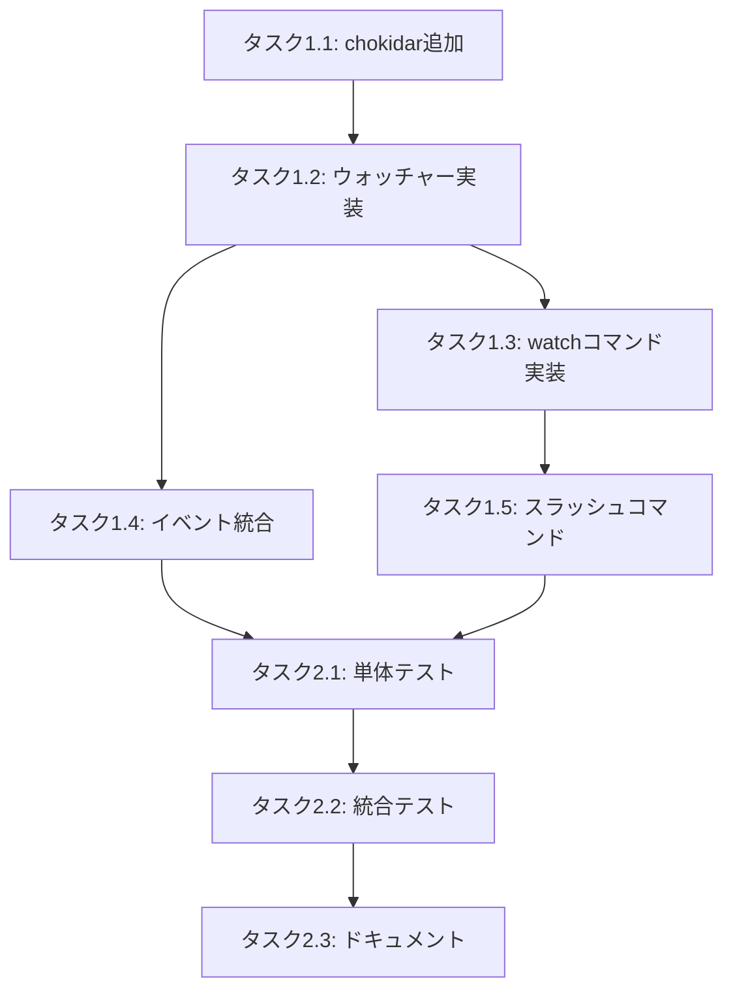

# 仕様書が更新されても対応する GitHub Issue が更新されない

**仕様書 ID:** d1b80586-c9ee-43a1-8a22-b81e12669d91
**フェーズ:** completed
**作成日時:** 2025/11/17 14:44:46
**更新日時:** 2025/11/17 14:57:00

---

## 1. 背景と目的

### 背景

現在の cc-craft-kit では、仕様書ファイル（`.cc-craft-kit/specs/*.md`）を直接編集しても、対応する GitHub Issue に変更内容が反映されない。

**現在の動作:**
- ✅ 仕様書作成時に GitHub Issue が自動作成される（`spec.created` イベント）
- ✅ フェーズ変更時に GitHub Issue のタイトル・ラベルが更新される（`spec.phase_changed` イベント）
- ❌ 仕様書ファイルを直接編集しても GitHub Issue には反映されない

**問題点:**
- `/cft:spec-update <spec-id>` コマンドを手動で実行しないと GitHub Issue にコメントが追加されない
- 仕様書ファイルを編集した際に、それを GitHub Issue に通知する仕組みが存在しない
- 開発者は仕様書更新後に毎回 `/cft:spec-update` を実行する必要がある（手間）

### 目的

仕様書ファイル（`.cc-craft-kit/specs/*.md`）が更新されたことを自動的に検知し、対応する GitHub Issue に更新通知を送信する仕組みを実装する。これにより、開発者は仕様書編集後に手動でコマンドを実行する必要がなくなり、GitHub Issue が常に最新の仕様書状態を反映するようになる。

---

## 2. 対象ユーザー

- **cc-craft-kit 利用者**: 仕様書を編集する開発者
- **GitHub Issue 閲覧者**: プロジェクトメンバーやステークホルダー

---

## 3. 受け入れ基準

### 必須要件

- [ ] 仕様書ファイル（`.cc-craft-kit/specs/*.md`）の変更を自動検知する仕組み
- [ ] 変更検知時に `spec.updated` イベントを自動発火
- [ ] GitHub Issue に仕様書更新通知コメントを自動追加

### 機能要件

#### パターン1: ファイルシステム監視（推奨）

- [ ] `fs.watch()` または `chokidar` を使用して `.cc-craft-kit/specs/` ディレクトリを監視
- [ ] `.md` ファイルの変更（`change` イベント）を検知
- [ ] デバウンス処理（連続した変更を 1 回にまとめる、例: 500ms）
- [ ] 変更されたファイルの spec ID を特定
- [ ] `spec.updated` イベントを発火
- [ ] バックグラウンドプロセスとして動作（`/cft:watch` コマンド）

#### パターン2: Git フック統合（補助的）

- [ ] Git pre-commit フックで変更された `.cc-craft-kit/specs/*.md` を検出
- [ ] コミット前に `spec.updated` イベントを発火
- [ ] フックのインストール・アンインストール機能

#### パターン3: 手動コマンド（既存機能の改善）

- [ ] `/cft:spec-update <spec-id>` コマンドの改善
- [ ] 複数仕様書の一括更新 `/cft:spec-update --all`

### 非機能要件

- [ ] ファイル監視のパフォーマンス影響を最小限に（CPU 使用率 < 5%）
- [ ] デバウンス処理により過剰なイベント発火を防止
- [ ] ログレベルの設定（debug/info/warn/error）
- [ ] エラー時のリトライ機能（GitHub API エラー時）

---

## 4. 制約条件

- ファイルシステム監視は開発環境でのみ動作（CI/CD 環境では不要）
- GitHub API レート制限を考慮（過剰な Issue 更新を避ける）
- `.cc-craft-kit/specs/` 以外のファイル変更は監視対象外

---

## 5. 依存関係

- **既存のイベントシステム**: `src/core/workflow/event-bus.ts`
- **GitHub統合ハンドラー**: `src/core/workflow/github-integration.ts`（469-520 行目に `spec.updated` ハンドラーが既に存在）
- **既存の `/cft:spec-update` コマンド**: `src/commands/spec/update.ts`

---

## 6. 参考情報

### 現在の実装状況

#### `spec.updated` イベントハンドラー（既に実装済み）

`src/core/workflow/github-integration.ts:469-520`
- GitHub Issue にコメントを追加する機能は既に実装されている
- `/cft:spec-update` コマンドで手動でイベントを発火可能

#### `/cft:spec-update` コマンド

`src/commands/spec/update.ts`
- データベースの `updated_at` を更新
- `spec.updated` イベントを発火
- GitHub Issue にコメント追加

### 技術選択肢

**ファイルシステム監視:**
- Node.js 標準 `fs.watch()` - 軽量だがプラットフォーム依存
- `chokidar` - クロスプラットフォーム対応、機能豊富（推奨）

**デバウンス:**
- `lodash.debounce` または自前実装

### 参考リンク

- [Node.js fs.watch()](https://nodejs.org/api/fs.html#fswatchfilename-options-listener)
- [chokidar](https://github.com/paulmillr/chokidar)
- [Git Hooks](https://git-scm.com/book/en/v2/Customizing-Git-Git-Hooks)

---

## 7. タスク分解

### フェーズ1: 基本実装（優先度: 高）

#### タスク1.1: chokidar パッケージの追加
- [ ] `chokidar` を `package.json` に追加
- [ ] `@types/node` の型定義確認
- [ ] 見積もり: 10 分

#### タスク1.2: ファイルウォッチャーサービスの実装
- [ ] `src/core/filesystem/watcher.ts` を作成
- [ ] `.cc-craft-kit/specs/` ディレクトリの監視機能
- [ ] `.md` ファイル変更の検知
- [ ] デバウンス処理（500ms）の実装
- [ ] ファイル名から spec ID を抽出
- [ ] 見積もり: 1 時間

#### タスク1.3: `/cft:watch` コマンドの実装
- [ ] `src/commands/watch.ts` を作成
- [ ] ウォッチャーの起動・停止機能
- [ ] プロセス管理（SIGINT/SIGTERM ハンドリング）
- [ ] ログ出力（変更検知時の通知）
- [ ] 見積もり: 1 時間

#### タスク1.4: イベント発火ロジックの統合
- [ ] ウォッチャーから `spec.updated` イベントを発火
- [ ] データベースの `updated_at` を更新
- [ ] エラーハンドリング（GitHub API 失敗時）
- [ ] 見積もり: 30 分

#### タスク1.5: スラッシュコマンドの追加
- [ ] `src/slash-commands/watch.md` を作成
- [ ] コマンドのドキュメント作成
- [ ] 見積もり: 15 分

### フェーズ2: テストとドキュメント（優先度: 中）

#### タスク2.1: 単体テストの作成
- [ ] `tests/core/filesystem/watcher.test.ts` を作成
- [ ] ファイル変更検知のテスト
- [ ] デバウンス処理のテスト
- [ ] エラーケースのテスト
- [ ] 見積もり: 1 時間

#### タスク2.2: 統合テストの作成
- [ ] E2E テスト: ファイル編集 → GitHub Issue 更新
- [ ] モックを使用した GitHub API テスト
- [ ] 見積もり: 1 時間

#### タスク2.3: ドキュメント作成
- [ ] `docs/WATCH_MODE.md` を作成
- [ ] 使用方法、トラブルシューティング
- [ ] パフォーマンスノート
- [ ] 見積もり: 30 分

### フェーズ3: 追加機能（優先度: 低）

#### タスク3.1: Git フック統合（オプション）
- [ ] `src/integrations/git/hooks.ts` を作成
- [ ] pre-commit フックのインストール機能
- [ ] 変更された `.md` ファイルの検出
- [ ] 見積もり: 2 時間

#### タスク3.2: 一括更新機能（オプション）
- [ ] `/cft:spec-update --all` の実装
- [ ] 変更されたすべての仕様書を一括更新
- [ ] 見積もり: 1 時間

### 総見積もり

- **フェーズ1（必須）**: 約 3 時間
- **フェーズ2（推奨）**: 約 2.5 時間
- **フェーズ3（オプション）**: 約 3 時間
- **合計**: 5.5〜8.5 時間

### 依存関係

