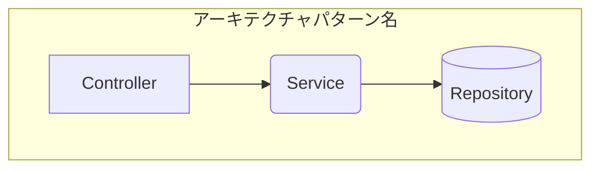
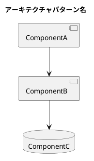
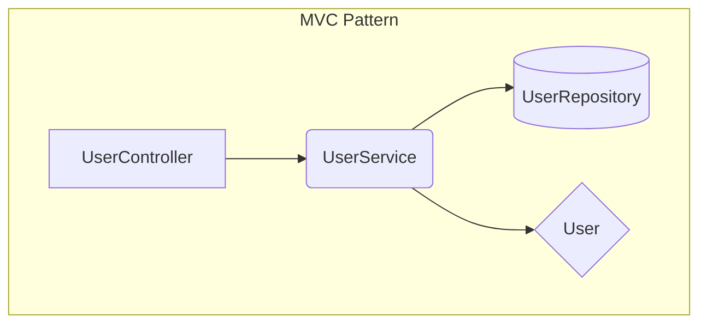
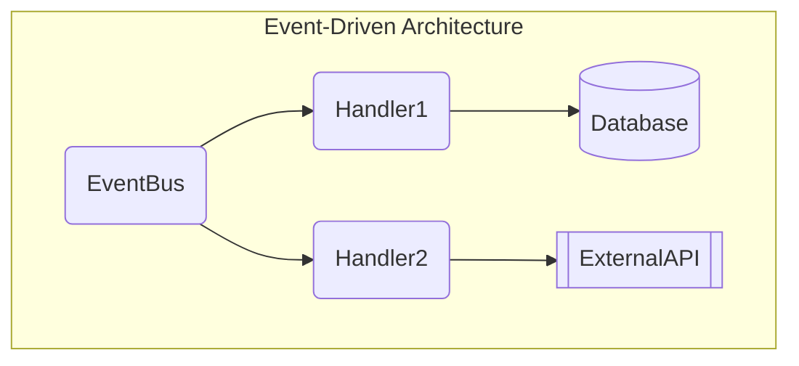

# Architecture Diagram Generator Skill

アーキテクチャ設計情報から視覚的な図を生成するスキルです。

## Capabilities

- **Mermaid 図生成**: GitHub/GitLab でレンダリング可能な図
- **PlantUML 図生成**: 詳細なコンポーネント図
- **ASCII 図生成**: テキストベースの簡易図

## Usage

### 入力要件

以下の情報を仕様書または設計ドキュメントから収集:

1. **アーキテクチャパターン**: 全体の設計パターン名
2. **コンポーネント一覧**: 名前、タイプ、依存関係
3. **データフロー** (オプション): データの流れの説明

### 出力形式

#### Mermaid 形式 (推奨)



#### PlantUML 形式



#### ASCII 形式

```
=== アーキテクチャパターン名 ===

Components:
  1. [Controller] ComponentA
  2. [Service] ComponentB
  3. [Repository] ComponentC

Dependencies:
  ComponentA
    └─> ComponentB
  ComponentB
    └─> ComponentC
```

## 実行手順

### Step 1: コンポーネント情報の収集

仕様書の設計セクション（`## 7. 設計詳細`）から以下を抽出:

- コンポーネント名
- コンポーネントタイプ（Controller, Service, Repository, Model, View, Utility）
- 依存関係

### Step 2: 図の生成

1. **形式選択**: 用途に応じて形式を選択
   - **Mermaid**: GitHub/GitLab README、仕様書埋め込み
   - **PlantUML**: 詳細設計ドキュメント
   - **ASCII**: ターミナル表示、テキストベース環境

2. **Mermaid 図生成ルール**:
   - `graph TD` でトップダウンレイアウト
   - `subgraph` でアーキテクチャパターンをグループ化
   - ノード形状でコンポーネントタイプを表現:
     - Controller: `[Name]` (四角)
     - Service: `(Name)` (丸角)
     - Repository: `[(Name)]` (円筒)
     - Model: `{Name}` (ダイヤモンド)
     - View: `>Name]` (非対称)
     - Utility: `[[Name]]` (二重四角)

3. **依存関係の矢印**:
   - `-->`: 通常の依存
   - `-.->`: オプショナルな依存
   - `==>`: 強い依存（継承など）

### Step 3: 出力

生成した図を以下のいずれかの方法で出力:

1. **仕様書への埋め込み**: Edit ツールで `## 7. 設計詳細` セクションに追加
2. **別ファイル出力**: Write ツールで `.cc-craft-kit/diagrams/` に保存

## Examples

### 例 1: MVC アーキテクチャ

**入力情報**:
- パターン: MVC
- コンポーネント:
  - UserController (Controller) → UserService
  - UserService (Service) → UserRepository
  - UserRepository (Repository)
  - User (Model)

**Mermaid 出力**:



### 例 2: イベント駆動アーキテクチャ

**入力情報**:
- パターン: Event-Driven
- コンポーネント:
  - EventBus (Service) → Handler1, Handler2
  - Handler1 (Service) → Database
  - Handler2 (Service) → ExternalAPI

**Mermaid 出力**:



## コンポーネントタイプ一覧

| タイプ | Mermaid 形状 | PlantUML タイプ | 説明 |
|--------|-------------|----------------|------|
| Controller | `[Name]` | component | リクエスト処理 |
| Service | `(Name)` | component | ビジネスロジック |
| Repository | `[(Name)]` | database | データアクセス |
| Model | `{Name}` | class | データモデル |
| View | `>Name]` | interface | 表示レイヤー |
| Utility | `[[Name]]` | component | ユーティリティ |

## Best Practices

1. **シンプルに保つ**: 1 図に 10 コンポーネント以下を推奨
2. **階層化**: 複雑なシステムは複数の図に分割
3. **命名規則**: コンポーネント名は Pascal Case
4. **色分け** (Mermaid): `style` ディレクティブで重要コンポーネントを強調

## 関連スキル

- `database-schema-validator`: データベース層の設計検証
- `typescript-eslint`: コード品質チェック
